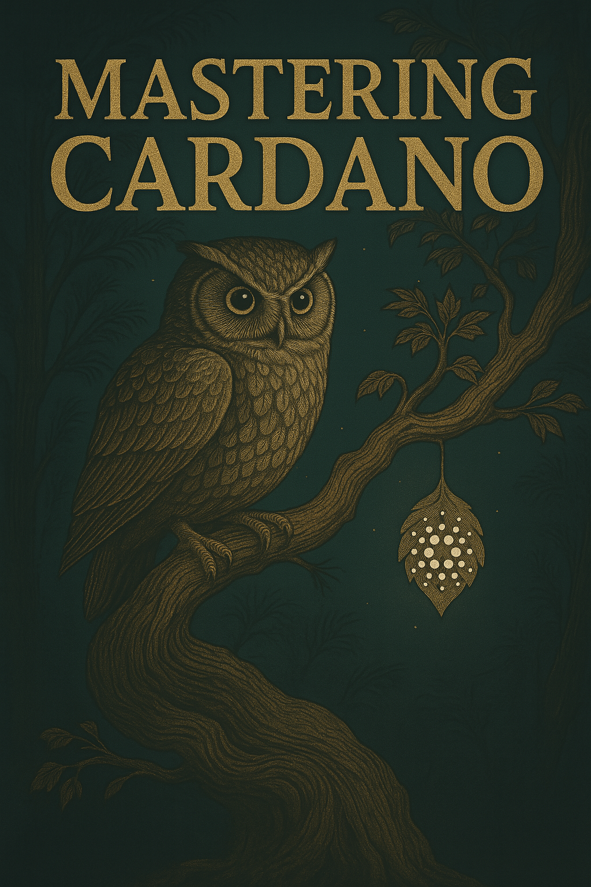

# **Mastering Cardano: An open-source guide to the Cardano ecosystem**



**Mastering Cardano is now available from [Book.io](https://book.io/)! [Purchase your copy here (coming soon!)](https://www.google.com/search?q=https://book.io/placeholder-for-mastering-cardano).**

Welcome to _Mastering Cardano_, a comprehensive, open-source book dedicated to exploring the depths of the Cardano blockchain. This book is a collaborative effort, written by experts and the community, for anyone interested in understanding, building on, or participating in the Cardano ecosystem.

_Mastering Cardano_ is a living document, intended to evolve with the Cardano platform. We invite you, the reader, to join us in this journey of learning and contribution.

## **About the Book**

_Mastering Cardano_ provides a thorough exploration of the Cardano blockchain, from its foundational principles to the intricacies of smart contract development and decentralized governance. The book is structured to cater to a wide audience, including developers, stake pool operators, students, and enthusiasts.

### **Table of contents**

1. _Introduction_ — a primer on blockchain technology, smart contracts, and the foundational concepts of Cardano.
2. _Cryptography_ — an overview of the cryptographic principles that secure the Cardano network.
3. _Learn about Cardano_ — a deep dive into the history, core principles, and ecosystem of Cardano.
4. _How Cardano works_ — detailed explanations of the Cardano node, the EUTXO model, Ouroboros consensus, and native assets.
5. _Cardano governance_ — an exploration of Cardano's decentralized governance model, including CIPs, Project Catalyst, and the Age of Voltaire.
6. _Cardano digital wallets_ — a guide to using and understanding digital wallets within the Cardano ecosystem.
7. _Stake pools and stake pool operation_ — a comprehensive guide for aspiring and current stake pool operators.
8. _Writing smart contracts_ — a practical guide to developing smart contracts on Cardano using Plutus and Marlowe.
9. _Decentralized applications (DApps)_ — an introduction to building and interacting with DApps on Cardano.
10. _Looking forward_ — a glimpse into the future of Cardano, including scaling solutions like Hydra and Mithril.

## **How to use this book**

_Mastering Cardano_ is designed to be flexible. You can read it from start to finish or follow one of the suggested reading paths tailored to your interests:

* _Cardano fundamentals path_ — for beginners who want a solid understanding of blockchain and Cardano.
* _Smart contracts developer path_ — for developers looking to build smart contracts and DApps on Cardano.
* _Cardano user path_ — for non-technical users who want to learn how to use and interact with the Cardano ecosystem.
* _Stake pool operator path_ — for those interested in running and maintaining a stake pool.
* _Cardano governance and future path_ — for readers interested in the long-term vision and governance of Cardano.

## **Building the book**

This book is written in AsciiDoc. To build your own PDF and EPUB versions from the source, please follow these steps.

### **Prerequisites**

* _Ruby and Bundler_ — the build process relies on Ruby and Bundler. Please ensure you have a recent version of Ruby installed.
* _Graphviz_ — required for rendering diagrams in the book.

### **Build instructions**

1. Clone the repository, as follows:
   ```
   git clone https://github.com/input-output-hk/mastering-cardano.git
   cd mastering-cardano
   ```

2. Install dependencies, as follows:
   This project uses Bundler to manage Ruby gems. Install the required gems with:
   ```
   bundle install
   ```

3. Install Graphviz:
   On Debian-based systems (like Ubuntu), you can install Graphviz with:
   ```
   sudo apt-get update && sudo apt-get install -y graphviz
   ```

4. Build the book:
   You can build both the PDF and EPUB versions using the Makefile: `make`

   Alternatively, you can build each format individually:
   * To build the PDF: `make pdf`
   * To build the EPUB: `make epub`

The generated files will be placed in the `dist/` directory.

## **Contributing**

_Mastering Cardano_ is a community-driven project, and we welcome contributions of all kinds. Whether you're fixing a typo, clarifying a concept, or adding new content, your input is valuable.

To contribute, please fork the repository and submit a pull request with your proposed changes. For more significant changes, we recommend opening an issue first to discuss your ideas with the community.

## **About the authors**

_Mastering Cardano_ is authored by _Dr. Lars Brünjes_, Director of Education at IO, and _Prof. Joshua Ellul_, Director of the Centre for DLT at the University of Malta, with contributions from numerous experts and community members. This book is a testament to the collaborative and open-source spirit of the Cardano ecosystem.

We hope you enjoy reading _Mastering Cardano_ and find it a valuable resource on your journey into the world of blockchain. Happy reading!
