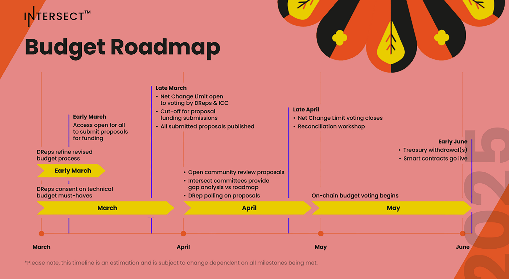

TO DO:

- Time of last update: Thurs 17th July 2025.
- Asciidoc format = https://gist.github.com/powerman/d56b2675dfed38deb298

== Cardano governance

IO has been researching on-chain governance for some time, focusing on this crucial area since the original https://why.cardano.org/en/introduction/motivation[Why Cardano] essay. Research papers dating back to 2017 have proposed a treasury for Ethereum Classic.footnote:disclaimer[Kaidalov, Kovalchuk, Nastenko, Rodinko, Shevtzov, Oliynykov (2017), ‘A proposal for an Ethereum Classic Treasury System’, iohk.io/en/research/library/papers/a-proposal-for-an-ethereum-classic-treasury-system/] Another paper, authored at Lancaster University(((Lancaster University))),footnote:[Zhang, Oliynykov and Balogun (2019), ‘A Treasury System for Cryptocurrencies: Enabling Better Collaborative Intelligence’, eprint.iacr.org/2018/435.pdf] explored the concept of a treasury system and a viable, democratic approach to long-term development financing for Cardano.

Formal methods, machine-comprehensible specifications(((machine-comprehensible specifications))), and integrating a treasury system with this process for financial incentives are just some of the solutions pursued. Let’s discuss some of the mechanisms used thus far to enable governance on Cardano. Each component complements the others, contributing valuable lessons and experience as the age of Voltaire unfolds.

=== Cardano Improvement Proposals (CIPs)

Similar concepts exist for other blockchains, such as the Bitcoin Improvement Proposals (BIPs) or the Ethereum Improvement Proposals(((Ethereum Improvement Proposals))) (EIPs). While these share similarities, each works quite differently. In November 2020, http://github.com/cardano-foundation/CIPs/tree/master/CIP-0001[CIP-0001] was drafted to explain what a CIP is. A CIP is a formal, structured document proposing a solution to a common problem, highlighting various options and their trade-offs.

Anyone with ideas for enhancing Cardano can present CIPs. While CIPs are not a formal component of Cardano governance(((Cardano, governance))), they help steer the protocol and tooling in the right direction, benefiting the entire ecosystem.

The first CIP, created in October 2019 and later named https://cips.cardano.org(((cips.cardano.org)))/cip/CIP-1852[CIP-1852], extends http://github.com/bitcoin/bips/blob/master/bip-0044.mediawiki[BIP44] and documents how Cardano wallets manage keys and addresses. This document predates the formal CIP process. The CIP was named CIP-1852 by Sebastien Guillemot after the year Ada Lovelace passed away, with her birth year, 1815, used in the cointype field.

A CIP follows a standard format with a templated proposal structure that facilitates debate and evaluation. This structure allows community members to provide feedback on improvement recommendations or issues within a proposal. CIPs are stored as text files in a versioned http://github.com/cardano-foundation/CIPs[GitHub repository], where their revision history provides the proposal’s historical record. For those not on GitHub, the auto-generated sister site, cips.cardano.org, serves as a user-friendly resource maintained by the Cardano Foundation(((Cardano, Foundation))).

Every CIP has the following format:

* Preamble
* Abstract
* Motivation
* Specification
* Rationale
* Path to active
* Copyright

The concept is developed as a written proposal and submitted as a pull request(((pull request))) to the CIP repository after initial discussion and feedback. The CIP editors then publicly process the updated draft CIP as follows:

image::../images/5.1_cip_workflow.png[]

*Figure 5.1:* CIP workflow from CIP-0001

CIPs are processed in a semi-formal manner. Editors of CIP proposals(((proposals))) meet regularly to discuss and evaluate ideas. The fortnightly meeting http://github.com/cardano-foundation/CIPs/tree/master/BiweeklyMeetings[minutes] are publicly available.

=== Project Catalyst: democratizing innovation in Cardano

https://projectcatalyst.io/[Project Catalyst], one of the world’s largest decentralized innovation funds(((decentralized innovation funds))), is a key component of the Cardano ecosystem. It aims to drive Cardano's evolution through community-driven funding and development initiatives to address real-world challenges. Catalyst empowers the Cardano community to propose, vote on, and fund proposals to foster innovation and growth within the ecosystem.

Launched in 2020, Project Catalyst represents a significant milestone in the Cardano roadmap. It reflects the project's commitment to decentralized governance(((decentralized governance))) and community empowerment and marks the transition from a research-driven initiative to a community-led innovation hub.

The primary goals of Project Catalyst(((Project Catalyst))) are to:

* foster innovation and development within the Cardano ecosystem
* enable community participation in governance and decision-making
* distribute funds transparently to high-potential projects that can solve real-world problems.

==== How Project Catalyst works

*The funding mechanism*

Project Catalyst's funding mechanism is designed to support various innovative projects within the Cardano ecosystem(((Cardano, ecosystem))). It operates through a series of iterative funding rounds, known as funds, each with its own budget, themes, and goals.

The funds for Project Catalyst(((Project Catalyst))) are sourced from the Cardano treasury, which is replenished through a combination of:

- transaction fees, which are small fees collected from each transaction processed on the Cardano network
- reserve funds, which come from a portion of Cardano’s initial supply allocated to a reserve for long-term ecosystem development funding.

*Structure of funding rounds*

Each funding(((funding))) round operates cyclically, typically lasting several weeks to a few months. Each fund is identified numerically (eg, Fund1, Fund2) and has a defined budget. The structure of a funding(((funding))) round generally includes the following phases:

1. *Proposal submission(((Proposal submission)))*: innovators submit their project proposals on the https://cardano.ideascale.com/[IdeaScale platform]. Each proposal must align with the thematic goals set for that particular fund.
2. *Community review(((Community review)))*: during this phase, the community reviews and provides feedback on the submitted proposals.
3. *Voting*: any ada holder can vote on proposals using the Catalyst voting application(((Catalyst, voting application))). Voting power is proportional to the amount of ada held, incentivizing ada holders to participate actively in the governance process.
4. *Funding allocation(((Funding allocation)))*: based on the voting results, funds are allocated to the awarded proposals. Proposals with the highest votes receive funding until the budget for that fund is exhausted.

For more information about how Project Catalyst(((Project Catalyst))) works, read the https://projectcatalyst.io/how-it-works[‘How it works’ section] on Project Catalyst(((Project Catalyst)))’s website.

*Voting process*

Voting is a critical component of Project Catalyst(((Project Catalyst))), as it empowers the Cardano community to have a direct say in which proposals receive funding. This process ensures that decisions are decentralized and reflective of the community's collective priorities. Here’s an in-depth look at how the voting process works:

1. *Download* the https://projectcatalyst.io/get-involved/become-a-voter[Catalyst Voting App] -- available on mobile devices.
2. *Registration*. The registration process involves taking a snapshot of the participant’s ada holdings at a specific point in time. This snapshot determines the voting power(((voting power))) of each participant.
3. *Reviewing proposals*. All proposals are publicly accessible on the _IdeaScale_ platform and the voting application. Detailed information about each proposal, including the problem statement, proposed solution, team details, and budget, is available for discussion and feedback.
4. *Voting begins*. For each proposal, voters typically have multiple options to express their support or opposition. Once you’ve cast a vote on the blockchain(((blockchain))), you cannot change it.
5. *Counting votes*. After the voting period ends, votes are tallied.
6. The *results are announced* publicly, detailing which proposals have been selected for funding.

After each funding round, feedback from the community is collected to identify areas for improvement in the voting process. Based on community feedback, enhancements are made to the voting process, such as improving the user interface of the voting application, increasing security measures, and refining the proposal evaluation criteria(((proposal evaluation criteria))).

*Transparency and accountability*

Project Catalyst(((Project Catalyst))) places a strong emphasis on transparency and accountability through the following measures:

* publicly accessible proposals: all proposals and their progress are publicly accessible on the IdeaScale platform, allowing the community to track their development
* regular updates: funded projects are required to provide regular updates on their progress, including milestones achieved and funds spent
* community oversight: the community plays an active role in monitoring and evaluating the progress of funded projects, ensuring that funds are used effectively.

==== Success metrics in Project Catalyst

Measuring the success of Project Catalyst is essential to ensure that the initiative effectively fosters innovation and contributes to the growth of the Cardano ecosystem(((Cardano, ecosystem))). The following metrics provide a comprehensive evaluation of its impact and effectiveness:

1. number of proposals submitted(((number of proposals submitted)))
2. number of proposals funded(((number of proposals funded)))
3. community participation in voting(((community participation in voting)))
4. diversity of funded projects(((diversity of funded projects)))
5. impact of funded projects(((impact of funded projects)))
6. budget utilization and efficiency(((budget utilization and efficiency)))
7. community feedback and satisfaction(((community feedback and satisfaction)))
8. growth in Project Catalyst participation(((growth in Project Catalyst participation)))
9. long-term sustainability(((long-term sustainability))) and scalability.

Catalyst continues to improve and evolve with shared learnings. For example, funded projects(((projects))) from Funds 9–13 can now avail themselves of legal support from _Storm Partners_. This may include:

* Contract Review and Protection
* Global Dapp Compliance
* Crypto-Friendly Incorporation
* Decentralized Payment Compliance
* Smart Contract Legal Advice
* Token Classification Support.

The Catalyst team released their http://projectcatalyst.io/reports/horizons.pdf[Catalyst Horizons report] documenting various milestones. To dig deeper into the stats and trends, visit the https://projectcatalyst.io/reports[Reports] section of projectcatalyst.io for the latest data.

=== The age of Voltaire

As Catalyst took a ‘tactical pause’ after Fund9, there was a timely _Systemization of Knowledge (SoK)_ research paperfootnote:[Kiayias, Lazos (2022), 'SoK: Blockchain Governance', arxiv.org/pdf/2201.07188.pdf] published, reflecting on the state of governance in ten blockchains, including Bitcoin, Ethereum, and Cardano.

The paper lists *seven properties* to assess different requirements for effective blockchain(((blockchain))) governance:

1. *Suffrage*: this property deals with participation eligibility. How inclusive(((inclusive))) is the governance mechanism?
2. *Confidentiality(((Confidentiality)))*: are decision-makers’ inputs protected from ‘external influences’?
3. *Verifiability(((Verifiability)))*: can decision-makers confirm their input has been considered in the output?
4. *Accountability(((Accountability)))*: are decision-makers held accountable for their input?
5. *Sustainability(((Sustainability)))*: are decision-makers suitably incentivized?
6. *Pareto efficiency(((Pareto efficiency)))*: how effectively can decision-makers' intentions be turned into actions?
7. *Liveness*: how quickly can a blockchain(((blockchain)))’s governance mechanism produce outputs efficiently?

image::../images/5.2_governance_properties.png[]
*Figure 5.2:* The partition map of governance properties from the ‘SoK: Blockchain Governance’ paper

The paper concludes that while each blockchain(((blockchain))) displays some of the properties, no blockchain(((blockchain))) meets all the requirements for effective governance. It was food for thought just before the dawn of the _age of Voltaire_.

*CIP-1694*

https://cips.cardano.org/cip/CIP-1694[CIP-1694] was named after the philosopher Voltaire’s year of birth. It is arguably the most important CIP to date as it is a proposal to bootstrap the age of Voltaire. Co-authored by Charles Hoskinson(((Hoskinson, Charles))), it is the first CIP he has gotten directly involved with. It’s clear a lot of thought went into it, and it was intentionally written as a transitional, living document.

When Cardano was formed, there was a tripartite structure with EMURGO, the Cardano Foundation (CF), and IOG with remits for ecosystem growth, governance, and engineering, respectively. The intention was always to move to a stake based governance model(((stake based governance model))), where ada holders determine the future of the protocol.

CIP-1694 is the fruit of years of research. IOG has been working on a decentralized update system(((decentralized update system))) for some time. For example, they wrote a paper _Updateable Blockchains_footnote:[Ciampi, Karayannidis, Kiayias and Zindros (2020), 'Updatable Blockchains', iohk.io/en/research/library/papers/updatable-blockchains/] to explore ways to implement this vision.

Early in 2022, IOG and the CF held workshops to hammer out a way forward for the Voltaire development phase. The first question was ‘What is good governance?’. Charles Hoskinson(((Hoskinson, Charles))) explained in his ScotFest keynote that the answer was based on three different categories:

1. The *concept of representation* involves consent regarding decision-making authority(((decision-making authority))). There are two types: *direct representation*, where individuals vote personally, and *delegated authority*, where individuals hand their vote to someone else. In CIP-1694, this role is called a delegate representative (DRep). This concept was discussed, but as yet not implemented, in Project Catalyst.

2. Governance requires a set of rules, often called a constitution, which serves as guardrails to provide stability. In a blockchain context, a constitution can be machine-readable. Formal specifications(((Formal specifications))) can act as blueprints for Cardano, enabling integration with an update system. Once a voting system is established, the constitution can be ratified, hashed, and embedded in a transaction. This allows users to sign a type of ‘end user agreement’ by signing the transaction.

3. *Institutions* are often seen as targets for decentralization. If the goal is to ‘kill the middleman’, why do institutions matter? At their best, institutions set standards and provide a review process conducted by domain experts. Institutions are essential for good governance as they are the custodians of knowledge and best practices. People can be biased, so objective, neutral bodies are sometimes necessary for guidance. After careful consideration, it was determined that the most important ‘anchor’ institution would be a *members-based organization* (MBO) which should operate similarly to other open-source initiatives like the Linux Foundation, or the Cloud Native Computing Foundation(((Cloud Native Computing Foundation))) (CNCF).

*What is an MBO?*

The MBO is a central hub that unites different groups, including thousands of stake pool operators(((stake pool operators))), Cardano ambassadors, open-source projects running on Cardano, IOG, CF, EMURGO, and all ada holders. Members will own and run the MBO, staffing the steering committees.

image::../images/5.3_gov_concepts.png[]
*Figure 5.3:* Governance concepts defined, based on the slide from ScotFest 2022

The MBO, later christened _Intersect_, is Voltaire's anchor institution, but it is not the only one. IOG has been steadily building out its presence in universities all over the globe, as well as opening the Hoskinson Center for Formal Mathematics(((Hoskinson Center for Formal Mathematics))), the Zero-Knowledge Lab, and -- not forgetting -- the Edinburgh Decentralization Index (EDI).  Other institutions and MBOs will follow with different focuses and priorities.

_"Institutions… their only job is to take complexity and turn it into simplicity"_
-- Charles Hoskinson footnote:[Charles Hoskinson: Crypto regulations & policy, Importance of stablecoins & the future of Cardano, youtu.be/uEV8tQ6z87k?si=iVazdagl5JWZez3q&t=1983]

CIP-1694 could fill a book on its own and, like all CIPs, is a living document that evolves with feedback. It aims to bootstrap the Voltaire development phase, integrating on-chain and off-chain components for ecosystem self-governance. The ultimate aim is a fully end-to-end, on-chain governance layer(((on-chain governance layer))) for Cardano.

*Where we came from – the five out of seven system*

Before the Chang hard fork, governance transactions(((governance transactions))) (eg, hard forks, parameter changes, etc) required a signature from at least five out of the seven Cardano governance (genesis) keys, currently held by the three founding entities. This process was always intended to be an ephemeral form of governance as we got through the earlier phases of the roadmap before Voltaire. There have traditionally been just two types of governance transactions(((governance transactions))):

* protocol parameter updates using transaction http://github.com/input-output-hk/cardano-ledger/blob/8884d921c8c3c6e216a659fca46caf729282058b/eras/babbage/test-suite/cddl-files/babbage.cddl#L56[field nº6 of the transaction body]
* movements of the treasury and the reserves using Move Instantaneous Rewards (MIR) certificates.

*Where we are now*

The CIP-1694 proposal encompasses two new ledger eras. The first era is called Conway, after the celebrated English mathematician John Horton Conway(((Conway, John Horton))). The Conway ledger era:

* introduced SPO voting for hard forks
* provided an on-chain mechanism for rotating the governance keys
* rewired the ledger rules involving governance as outlined in CIP-1694.

For CIP-1694 to succeed, it is essential to realize the vision presented in the _Road to a Polyglot Ecosystem for Cardano_ whiteboard http://youtube.com/watch?v=skcCg1WaedA[video]. The new governance mechanisms will support multiple clients, enabling different development teams to employ different approaches, programming languages, and commercial unique selling propositions(((commercial unique selling propositions))) (USPs).

Charles Hoskinson(((Hoskinson, Charles)))’s keynote at ScotFest 2022:footnote:[ IO ScotFest Keynote with Charles Hoskinson, youtu.be/tbtkClr3Y3I]

_"So that's Voltaire …it’s deeply philosophical, it's the hardest thing I've ever done in my life, it's the hardest thing you're ever going to do in your life, and we're going to get it done, because it needs to get done and I'm damn tired of our industry failing, and it's about time we can point to something and say ‘you know what, we did it the right way’. We have to tend to our own gardens first. That was a lesson of Candide. So we have to fix Cardano's governance before we have the right to complain about any other person's governance."_

2023 was all about debating how to implement CIP-1694. The CIP was written in a deliberately high-level, approachable format to stimulate discussion and feedback. The community(((community))) did not disappoint with 50 http://cip1694.intersectmbo.org/[workshops], 30 in-person and 20 online, with over 1,000 participants from 20+ countries.

In addition to community-led workshops(((community-led workshops))), IOG, EMURGO, and the Cardano Foundation co-hosted three governance workshops. The CF workshop took place in Zug, Switzerland, followed by EMURGO’s workshop in Tokyo, Japan. The final workshop, hosted by IOG in Edinburgh in July 2023, marked the conclusion of the CIP-1694 design feedback loop.

Dozens of blogs have been written, and contentious issues have been argued over Reddit, X (Twitter), and Telegram. It is impossible to acknowledge every voice here, but you can dig into the finer detail by following Nicolas Cerny(((Cerny, Nicolas)))’s
 http://forum.cardano.org/t/cardano-governance-updates-community-input-voltaire-phase-and-CIP1694-updates/115878[diary of events] on the Cardano Forum(((Cardano, Forum))).

Governance on Cardano hit a milestone on Friday, June 30, 2023, when the https://github.com/cardano-foundation/CIPs/pull/380[CIP-1694 pull request] was merged into the main branch of the Cardano Foundation CIP repository(((Cardano Foundation, CIP repository))). The proposal’s status advanced to the ‘Proposed’ stage.

As almost everything in Cardano takes the form of a transaction, getting the metadata standard correct is critical. Metadata allows developers to embed information specific to the context of the transaction. For example, the NFT standard (see https://cips.cardano.org/cip/CIP-0025[CIP-25], https://cips.cardano.org/cip/CIP-0068[CIP-68], https://cips.cardano.org/cip/CIP-0060[CIP-60]) on Cardano has evolved with new capabilities, unlocking with each roadmap release. Pi Lanningham authored http://github.com/cardano-foundation/CIPs/pull/556[CIP-0100] to clear up what metadata standards need to be introduced to enable the on-chain governance(((on-chain governance))) mechanisms proposed in CIP-1694.

http://cips.cardano.org/cip/CIP-0095[CIP-95] is a crucial CIP, which extends CIP-30 and describes the interface between webpage/web-based stacks(((webpage/web-based stacks))) and Cardano wallets. More specifically, it is a specification that defines the API of the JavaScript object that is injected into web applications. The CIP enables voting capabilities for governance tools. At the Edinburgh hackathon, decisions were made around open http://github.com/Ryun1/CIPs/blob/governance-wallet-connector/CIP-0095/README.md#open-questions[questions], and the base design was approved.

As governance can be subjective, it's best you read CIP-1694 yourself, especially the Rationale(((Rationale))) and Changelog sections, which add context. If 2023 was the year we discussed governance, 2024 was all about implementation with Intersect as the main driving force.

=== Intersect: shaping Cardano's future

Intersect is a member-based organization for the Cardano ecosystem, founded in 2023. It serves as an aggregation point for the entire Cardano community, placing the community at the heart of Cardano’s future development and harnessing the untapped potential of collective wisdom and economic energy. Intersect brings together companies, developers, individuals, institutions, and other ecosystem participants to shape and drive the future development of Cardano. It acts as a steward of the underlying blueprints and technology for the community, beginning with the Cardano node, core technology libraries(((core technology libraries))), and components required to operate the protocol, along with all of its accompanying documentation, knowledge, and contributors.

This governance structure is designed to enhance decentralized growth within the Cardano ecosystem. It seeks to enable community-driven decision-making through democratic voting, defines clear roles and responsibilities, and ensures accountability. Intersect, as an MBO, manages funds for ecosystem projects, aligns efforts with long-term strategic goals, and fosters inclusive community participation. It also improves coordination, increases accountability, and supports sustainable growth by providing a structured yet decentralized framework(((structured yet decentralized framework))). Implementation involves community consensus, framework development, regulatory compliance, securing funding, and ongoing management. This model empowers the Cardano community and aligns with its vision of decentralization and transparency.

https://www.intersectmbo.org/[Intersect] empowers a distributed network of builders and contributors(((distributed network of builders and contributors))) who believe that every voice holds value and that collaboration leads to stronger outcomes. Members forge a secure, collaborative ecosystem to ensure Cardano's sustained growth and evolution in a safe space.

==== How Intersect operates

Intersect aims to administer the governing processes(((governing processes))) for Cardano’s continued roadmap and development of the Cardano protocol. Intersect is currently facilitating the rollout of Cardano’s governance features. Visit the Intersect latest https://www.intersectmbo.org/news[news] page to keep up to speed with the latest developments.

All Cardano ecosystem participants are welcome to become Intersect members. Made up of a distributed group of participants, including the foremost experts on Cardano and current ecosystem contributors(((current ecosystem contributors))), Intersect aims to facilitate healthy discussions and sound decision-making amongst its members and the community to uncover pain points and champion successes.

*The five pillars of Intersect*

1. Community support(((Community support))): Hosts events, hackathons, and conferences designed explicitly for developers within the Cardano ecosystem.
2. Governance: Champions and oversees Cardano’s community-driven governance system(((community-driven governance system))), implemented through CIP-1694.
3. Technical roadmap(((technical roadmap))): Helps orchestrate the delivery of the Cardano technical roadmap.
4. Continuity: Ensures system stability(((system stability))), Intersect facilitates Cardano’s ongoing continuity.
5. Open-source development(((Open-source development))): Plays a role in coordinating the open-source development of Cardano’s core technologies.

Intersect has a central governing board(((central governing board))), similar to a city council, chosen and managed by its members. This board is supported by various committees and working groups, each focusing on specific areas or interests within the Cardano ecosystem.

Intersect’s governing board started with five seats. Three were filled by founding members (seed funders, Input Output Global, and EMURGO), with the Intersect chief operating officer (COO) holding a temporary seat. Another seat was offered to the University of Wyoming’s Blockchain Center(((University of Wyoming’s Blockchain Center))) for a one-year term.

The remaining two permanent seats were filled later in 2024 through an election process with Kavinda Kariyapperuma and Adam Rusch voted in by Intersect members. The Board now plans to expand from five to seven, with the number of seats elected by Intersect members rising from two to four. This doubles the community representation, which will make up the majority of the seats at the board leadership level(((board leadership level))). The board meets monthly and publishes agendas and https://intersect.gitbook.io/intersect-board[minutes] for transparency, and can be contacted at board@intersectmbo.org.

*Intersect's funding*

Input Output Global(((Input Output Global))) and EMURGO initially funded Intersect to get things running. For future funding, the community will be asked to vote on using funds from the Cardano treasury.

The Cardano Development Holdings(((Cardano Development Holdings))) (CDH), established in the crypto-friendly Cayman Islands, funds and facilitates the maintenance, development, and growth of the Cardano ecosystem. It may receive direct funding from the Cardano treasury but can also receive donations from external sources for Cardano’s development. All CDH funds are administered by Intersect. This structure was chosen for reasons related to accounting, legal clarity, and liability management.

Becoming a founding member(((founding member))) comes with the following benefits:

- participate in steering groups, committees, and advisory boards, with the potential to establish new committees that will define Cardano's future governance
- access grants and contribute to developing Cardano's codebase while guiding a grant program to strengthen the Cardano protocol and ecosystem
- collaborate with other Cardano enthusiasts to build new partnerships and connections
- showcase contributions through member events, conferences, marketing materials, and member spotlights
- attend monthly meetings for updates on progress, committees, events, and funding opportunities
- participate in the annual meeting (in-person or virtually), focusing on Intersect activities, including voting on proposals. There are many https://intersect.gitbook.io/intersect-community-grants/overview/community-hub-faqs[Community Hubs], located worldwide, hosting events.

*Amending Intersect membership governance*

Proposals to change Intersect’s membership governance must be clearly documented. The board can approve amendments by a simple majority vote. There are various streams regarding the ongoing work that maintains and improves Cardano. Think of ‘continuity’ as the essential technical services(((essential technical services))) needed to keep Cardano running smoothly. This includes bug fixes, upgrades, and new developments like CIP-1694. It’s important to note that continuity focuses on the core infrastructure and many other exciting community projects and applications are being built on top.

Cardano’s vision(((Cardano, vision))) and backlog refer to Cardano’s future development, including new features and functionalities. These features may still be in the research phase or identified by the community for further exploration.

*Open-source development*

Cardano is an open-source project(((open-source project))), with over 40 code repositories maintained by Intersect and its members. You can find more information and explore these repositories on https://github.com/IntersectMBO[GitHub].

True open source means having the flexibility to choose different options. The Cardano Foundation also follows an open-source strategy. https://www.veridian.id/[Veridian Identity Platform], https://cardanofoundation.org/blog/unveiling-reeve-enterprise-reporting[Reeve] (enterprise financial reporting on-chain), https://aiken-lang.org[Aiken], http://github.com/CardanoSolutions/kupo#readme[Kupo], and http://ogmios.dev/[Ogmios] all follow open-source principles and make life easier for developers on Cardano.

Acknowledging that Java is still the preferred language for many enterprise developers, the CF created https://github.com/bloxbean/yaci-store[Yaci Store] (a modular library for Java developers) and the Veridian Identity Platform, as open-source tools with this audience in mind. The Veridian Identity Platform features a W3C-compatible mobile wallet for managing self-sovereign identities across Cardano and other blockchains. The wallet supports multiple standards, integrating key event receipt infrastructure(((key event receipt infrastructure))) (KERI) for interoperability to fit a broad range of use cases and enterprise adoption.

In addition, The Cardano Ballot project, a http://github.com/cardano-foundation/merkle-tree-java[Merkle Tree] in Java/Aiken, the Cardano conversions http://github.com/cardano-foundation/cf-cardano-conversions-java[library], and state channels layer 2(((state channels layer 2))) (hydra-java http://github.com/cardano-foundation/hydra-java[Client]) were all made open source. The CF also made the http://cardanofoundation.org/en/news/releasing-an-open-source-rewards-calculation/[rewards calculation] open source to enable anyone to perform and validate the rewards calculation independently of a single implementation.

*Open source office (OSO)*

The OSO manages Cardano’s open-source program and community. They ensure open and effective communication with the wider open-source community. Intersect manages contracts with companies(((contracts with companies))) working on Cardano’s development. Office hours are held twice a month, with an open format welcoming new topics. The OSO regularly produces content for the community. For example, the https://committees.docs.intersectmbo.org/intersect-open-source-committee/policies/contribution-ladder-framework[Contribution Ladder] serves as a framework to help new contributors engage with a project.

*Delivery assurance* ensures that projects are completed on time and according to specifications. This involves managing risks, tracking progress, and taking action to ensure successful completion. The approach varies based on the project’s size, complexity, and potential risks. You can review information about contract work completed, and in progress, on the Intersect knowledgebase.

=== Intersect structure

Intersect operates on the principle of community leadership(((community leadership))) for Cardano’s development. This is achieved through standing committees formed and led by its members. At present, seven standing committees report to the ISC (Intersect Steering Committee).

Standing committees are permanent committees covering various functions critical to guiding Cardano’s ‘continuity’ (ongoing maintenance and development), shaping Cardano’s constitution, and supporting internal membership needs(((supporting internal membership needs))). While changes can be made as the committees and their goals evolve, they are intended to be long-lasting.

Working groups are temporary and typically support a standing committee’s broader objectives. They may also be formed to tap into expertise outside of Intersect’s membership(((Intersect, membership))). Flexible and less formal than committees, working groups can address diverse topics relevant to Cardano’s development.

==== The civics committee
The civics committee acts as a guide and supervisor(((guide and supervisor))) for the Cardano community on governance issues:

- develop and manage ways for the community to actively participate in Cardano's governance
- collaborate with subject matter experts when needed
- assist the Cardano constitutional committee as requested.

This committee is crucial for ensuring Cardano’s governance system is accessible, fair, inclusive and transparent. The civics committee(((civics committee))) addresses topics like:

- ratifying the constitution: facilitating a period for community approval
- off-chain discussions: tracking and maintaining a record of informal discussions about proposals before they are formally presented
- on-chain voting tools: monitoring these tools to ensure they are fit for purpose
- voting guidelines: developing and updating clear instructions and best practices
- governance improvements: providing non-binding recommendations based on community input to enhance Cardano's governance system.
- budget guidance, for example, they released a https://committees.docs.intersectmbo.org/intersect-civics-committee/about/civics-committee-budget-guidance[guidance document] for the 2025 process.

==== Membership and community committee (MCC)

The MCC helps build a strong Cardano community(((strong Cardano community))) within Intersect. They achieve this by:

* attracting new members through effective sales and account management
* supporting existing members with helpful resources and events
* offering https://www.intersectmbo.org/grants[grants] to create useful community tools
* providing education and hosting engaging events

This committee creates a space for Cardano enthusiasts to connect, share knowledge, and collaborate on projects. For example, a grant was awarded to Ryan Wiley (Cerkoryn) for his _changwatch.com_ dashboard. This tool displays real-time governance action data through donut charts, breaking down participation in governance actions(((participation in governance actions))) by DReps, SPOs, the CC, and an aggregated total of all groups. This highlights which entities sway over each proposal type based on stake-weighted delegation and voting thresholds. Anyone in the Cardano ecosystem can flag specific centralization concerns with this user-friendly dashboard.

The MCC manages Intersect memberships, ensuring everyone gets the most out of the program and can contribute to Cardano’s development. They also review proposals for community working groups(((community working groups))). Public meetings are held every four weeks, and the minutes are https://intersect.gitbook.io/community-and-membership-committee/[public].

==== Growth and marketing committee
This committee takes the form of a strategic planning body, focused on impactful marketing and ecosystem growth and adoption. The _Marketing Strategy Working Group_ sits alongside the committee. Its mission is to formulate Cardano’s long-term marketing strategy(((Cardano, long-term marketing strategy))) and go-to-market plan. It endeavours to leverage the hive mind of the Cardano community and DReps.

==== The technical steering committee (TSC)

The TSC oversees Cardano’s technical health(((Cardano, technical health))), ensuring that decisions are based on solid technical knowledge and best practices.

This committee brings together key players to ensure Cardano’s development runs smoothly. They handle contracts with developers, create technical proposals, and review ideas from the Cardano community(((ideas from the Cardano community))), like updates or major changes to the network.

The TSC leads in guiding the development of Cardano’s ongoing technical foundation. They provide in-depth technical analysis and advice for everything from development projects to network settings. Think of them as the guardians of Cardano’s technical well-being(((guardians of Cardano’s technical well-being))). The minutes from their meetings are https://intersect.gitbook.io/technical-steering-committee/tsc-meeting-minutes[public].

==== The parameters committee (PC)

The PC is a subcommittee within the TSC that focuses on optimizing Cardano’s settings(((optimizing Cardano’s settings))). They ensure these parameters are set based on the best technical knowledge available. They consider factors like economics, security, and network performance when recommending updates to Cardano’s core settings. Regular meetings discuss updates and consider proposals from the community to adjust parameters. There are advisory groups within the PC, such as:

* economic parameters advisory group
* network parameters advisory group
* technical parameters advisory group
* governance parameters advisory group.

Membership in this technical group is by invitation only. However, anyone can submit suggestions for parameter changes(((suggestions for parameter changes))) on the Cardano Forum. The PC also participates in monthly calls with Cardano’s stake pool operators to share updates and answer questions.

Matthew Capps’ http://twitter.com/cryptstitution/status/1725745468821344432?s=46[X thread], _Protocol Change Proposal-001: Chronology of Documented Events_, provides insight into the careful consideration and deliberation involved in a parameter change(((parameter change))).

==== The open source committee (OSC)

The OSC owns the roadmap (strategy) for Cardano’s open-source projects(((Cardano, open-source projects))), advising others on open-source best practices, and acts as a central point for anyone building within Cardano’s open-source environment.
This committee helps developers navigate the world of open-source development(((open-source development))) on Cardano.

The OSC tackles several key areas(((key areas))):

* defining what ‘open source’ means for Cardano projects
* developing and maintaining Cardano’s open-source strategy
* overseeing pilot projects for open source on Cardano
* establishing best practices for open-source development within Cardano
* creating a model for future open-source projects within Intersect
* running the _Developer Advocate Program_

An Open Source strategy can incur risks if relying on unpaid contributors to regularly show up. With this in mind, Christian Taylor proposed a solution called the https://493748844-files.gitbook.io/~/files/v0/b/gitbook-x-prod.appspot.com/o/spaces%2FLBdnzp0eZpGri9sVpseI%2Fuploads%2FvuisqFT8uCyKSDgpNmyW%2FPaid%20Open%20Source%20Model-%20LIVE.pdf?alt=media&token=577c8bd1-c9df-43a0-8b57-e883ddb1254a[paid open source model], which can be adapted to other projects, offering hope for a more sustainable and secure open source ecosystem(((secure open source ecosystem))).

==== Cardano budget committee

The budget committee manages Cardano’s operational costs and creates a yearly budget for community review and approval(((community review and approval))). The committee provides clear information on Cardano’s core expenses, ensuring transparency for the community.

How it works:

* the _product committee_ provides a list of approved projects
* the _budget committee_ will then assign costs to these projects and create a budget proposal
* the community will vote on the budget proposal at the annual members meeting (AMM)
* upon approval, funds will be allocated from the Cardano treasury through on-chain voting.

*Figure 5.4:* Provisional Budget process timeline

*Product committee*

The product committee manages and tracks the roadmap for development items(((roadmap for development items))). Their responsibilities include facilitating processes to converge on a shared vision and roadmap. The committee encouraged the community to submit projects for consideration for the 2025 roadmap, with an https://committees.docs.intersectmbo.org/intersect-technical-steering-committee/technical-roadmap/how-to-participate-in-shaping-the-technical-roadmap[explainer] to guide them through the process.

*Working groups*

Intersect forms temporary groups called working groups to address specific needs as they arise. These groups can focus on any topic and operate less formally than the permanent committees(((permanent committees))). Each working group has the following specifications:

* defines its purpose, operating procedures, and member roles and responsibilities in a terms-of-reference document
* observes participation limitations, like application processes or elections, are set with board approval
* establishes meeting frequency and procedures
* works under a specific committee but may collaborate with others
* reports their progress and findings to their overseeing committee(s).

Intersect's *hard fork working group* was one of the busiest as it oversaw the Chang and Plomin upgrades. It began as just three attendees on the first call in February 2024. As the working group has met at least weekly, often more, the attendee list grew to over sixty. The group’s last call was almost a year later on Tuesday, February 11, 2025, fulfilling its remit to oversee all aspects of the Chang and Plomin hard forks(((Plomin hard forks))) to a successful conclusion.

To learn more, head over to the Intersect https://intersect.gitbook.io/intersect-working-groups/[working groups(((working groups)))] space for a complete list and further details.
Committees are elected by Intersect members only, using a one-member, one-vote system(((one-member, one-vote system))). Elections take place twice yearly. Half of each committee’s members were elected in the first elections in October 2024, and the remaining members were elected in 2025. The official final numbers for newly elected committees were made up of a “Who’s Who” of Cardano’s brains trust:

image::../images/5.5_committee_election_results.png[]
*Figure 5.5:* Committee Election results

=== Cardano governance: a three-part approach

Cardano(((Cardano)))'s future governance leans on three key pillars:

1. *On-chain decisions(((On-chain decisions)))*: this system (detailed in CIP-1694) allows ada holders to directly influence Cardano's development through proposed governance actions voted on-chain.
2. *Cardano constitution*: this evolving document outlines core rules to guide Cardano's growth during its transitional governance phase. A fully-fledged constitution will be drafted with community input throughout the year, culminating in a final version ratified by both delegates and ada holders. https://github.com/Ryun1/CIPs/tree/cip-constitution-tech/CIP-0120[CIP-0120 (constitution specification)] proposes a standardized technical format to make the document accessible for tools to read, render, and write(((tools to read, render, and write))).
3. *Institutions*: these provide spaces for discussion, collaboration, and recommendations that ultimately feed into on-chain decision-making(((on-chain decision-making))).

These three elements work together to create a robust governance system(((robust governance system))) that can adapt and improve over time, driven by the Cardano community. The age of Voltaire is still in its infancy, and four key roles will be pivotal as CIP-1694 becomes a reality.

*Ada holders*

Ada holders play a crucial role(((crucial role))) in Cardano's governance. They can:

* delegate their vote: choose representatives (DReps) to cast votes on their behalf
* become a DRep: represent themselves or others in on-chain voting
* shape Cardano's future: propose changes to the network by submitting on-chain governance actions
* stay informed: review submitted governance actions and cast their vote on them.

By actively participating, ada holders collectively drive Cardano's development(((collectively drive Cardano's development))).

*DReps*

The _age of Voltaire_ introduced delegate representatives(((delegate representatives))) (DReps), a new concept central to Cardano’s governance as defined in CIP-1694. DReps, alongside stake pool operators and the constitutional committee, will vote on proposals that shape Cardano's future.

Any ada holder can become a DRep. This means ada holders can choose to directly participate in voting or delegate their voting power to DReps they trust. There are two predefined DReps: the _abstain_ and the _no confidence_ DReps. These options allow ada holders to either not participate in governance or automatically express a yes vote on any _no confidence_ action, providing a directly auditable measure of confidence(((directly auditable measure of confidence))) in the constitutional committee.

*Why delegate?*

Delegation allows ada holders to empower representatives who are potentially better equipped to make informed decisions on their behalf. This fosters a more democratic system where everyone has a say, even if they don’t have the time or expertise to delve into every proposal(((delve into every proposal))).

The first community DRep workshop(((community DRep workshop))) took place on January 20, 2024, in Oslo. This initiative was funded by a Catalyst Fund10 https://projectcatalyst.io/funds/10/f10-drep-improvement-and-onboarding/drep-recruitment-training-and-ethical-code-development-workshops[proposal] from Eyetein Hansen, Adam Rusch, Ekow Harding, Jose De Gamboa, Thomas Lindseth, and Yuki Oishi. Many more workshops followed.

Intersect collaborated with the IOG education team on the https://sancho.network/drep-pioneer-program/drep-pp/overview[DRep Pioneer program], an online interactive training course for nominated delegate representatives (DReps) involved in Cardano’s proposed governance structure(((Cardano, proposed governance structure))).

*Stake pool operators (SPOs)*

Think of SPOs as the caretakers of Cardano's network(((caretakers of Cardano's network))). They run stake pools, which are essentially servers that keep the blockchain running smoothly. These operators typically:

* own or rent servers running the Cardano node (both block-producing and relay nodes)
* hold the pool's key
* maintain and monitor the network nodes.

SPOs play a vital part in Cardano's on-chain voting(((on-chain voting))) governance by:

* proposing changes: they can submit governance actions to improve the network
* shaping the future: they can review and vote on proposed governance actions.

*The constitutional committee (CC)*

Unlike other Cardano governance bodies, the CC operates independently and entirely outside of Intersect. It is one of three key groups (alongside SPOs and DReps) that vote on proposals to change Cardano’s core systems through governance actions. The CC’s primary function is to review proposed changes with a limited focus -- ensuring that they align with the principles outlined in Cardano’s constitution(((principles outlined in Cardano’s constitution))).

=== Cardano governance flow

CIP-1694 outlines Cardano's on-chain governance process, but it's also important to consider the supporting off-chain activities(((supporting off-chain activities))).

*Off-chain proposal discussions*

Before proposals are submitted to the blockchain for official votes, there is a crucial off-chain stage for discussion and refinement(((discussion and refinement))). Off-chain debate allows for:

* clearer proposals: proposers can share more details, rationale, and supporting evidence to ensure everyone understands the idea
* community input: reviews, comments, and feedback help improve the proposal and gauge overall sentiment
* informed voters: off-chain discussions generate valuable context, which becomes part of the official proposal (metadata) on-chain, aiding voters in making informed decisions
* reduced burden: filtering and refining proposals off-chain minimizes the number of votes submitted on-chain, reducing stress on the blockchain.

Without a strong off-chain process, governance could falter, as ideas may not undergo thorough discussion or refinement. On-chain proposals might lack the necessary context(((lack the necessary context))), making informed voting difficult.

Intersect recognizes the importance of off-chain discussions and has issued a grant to establish a dedicated proposal discussion forum(((dedicated proposal discussion forum))). More information about the grant can be found in https://intersect.gitbook.io/intersect-community-grants/cohort-2/proposal-discussion-forum[Intersect's GitBook].

*Submitting on-chain governance actions*

Once a proposal has been thoroughly discussed and refined off-chain, it is ready for the official vote on the blockchain. This is known as on-chain governance action submission(((on-chain governance action submission))). Proposals can be submitted on-chain through the Cardano command-line interface (CLI) or via GovTool’s user-friendly interface. The specific content required for an on-chain proposal depends on the type of governance action being submitted. Proposers can optionally add metadata to provide additional context and information alongside the proposal.

=== Governance actions
What are governance actions? Imagine them as proposals submitted on the Cardano blockchain(((proposals submitted on the Cardano blockchain))) for voting. These proposals trigger events on the blockchain through transactions and have a set timeframe for voting before they expire and can’t be enacted. Any ada holder can submit a governance action for on-chain voting. Once a proposal is submitted and recorded on the ledger, voters can vote through separate voting transactions. Note a governance action requires a refundable deposit of 100,000 ADA to prevent spam and demonstrate commitment. The deposit is returned after the action is finalized.

CIP-1694 defines seven categories of governance actions(((seven categories of governance actions))):

1. Motion of no-confidence: creates a state of no-confidence in the current constitutional committee(((constitutional committee))).
2. New constitutional committee or quorum size(((New constitutional committee or quorum size))): proposes a change to the members of the constitutional committee and/or to its signature threshold and/or terms.
3. Updates to the constitution: proposes a change to the off-chain constitution, recorded as an on-chain hash of the text document(((on-chain hash of the text document))).
4. Hard fork initiation: triggers a non-backward compatible upgrade(((non-backward compatible upgrade))) of the network.
5. Protocol parameter changes: proposes a change to one or more updatable protocol parameters(((updatable protocol parameters))).
6. Treasury withdrawals(((treasury, withdrawal))): proposals for how to spend funds from the Cardano treasury.
7. Info(((Info))): simply provide information and don’t require enactment.

Governance actions vary in complexity. Info Actions and Treasury Withdrawals are relatively straightforward, but Constitutional updates require metadata, a constitution hash, a URL, and a proposal policy script. Protocol Parameter Changes(((Protocol Parameter Changes))) and Hard Fork Initiation are non-trivial to implement, requiring technical expertise. To demystify some of the processes, the CF published https://cardanofoundation.org/blog/understanding-cardano-governance-actions[flow charts] to encourage wider participation.

=== Registering as a DRep on-chain

DRep registration(((DRep registration))) occurs on the blockchain and can be done through the Cardano CLI or GovTool. During registration, DReps can optionally add details about themselves (metadata) to help ada holders decide who to delegate their votes to.

*On-chain DRep delegation*

On-chain delegation allows ada holders to give their voting power to a DRep of their choice. These DReps then cast votes on their behalf regarding active governance actions(((active governance actions))).

To make an informed decision, individuals should review the metadata submitted by DReps during registration. This metadata might include details like their expertise, areas of interest, and even past voting history(((past voting history))).

The delegation process happens on the blockchain and can be done through the Cardano CLI(((Cardano, CLI))) or GovTool.

*On-chain voting process*

On-chain voting is where the three voting groups (DReps, SPOs, and the CC) cast their votes on active governance actions(((active governance actions))).

For a proposed governance action to be approved and implemented, it needs to meet specific voting thresholds set by Cardano. These thresholds may vary depending on the type of governance action being voted on. In simpler terms, some proposals might require approval from all three voting groups, while others might only need a certain percentage from a specific group(((certain percentage from a specific group))).

image::../images/5.5_gov_actions.png[]
*Figure 5.6:* Voting on governance actions (based on a table from Intersect’s https://docs.intersectmbo.org/[documentation])

Following the on-chain voting process, a governance action is considered approved (or ratified) if it meets the specific voting thresholds(((specific voting thresholds))) set for its type. These thresholds determine the level of consensus needed from the different voting bodies.

For DReps, only ‘Yes’ votes contribute to the passage of a governance action(((passage of a governance action))), and not voting counts as ‘No’.

DRep voting is based on one lovelace, one vote. The passing threshold for an action is the stake voted ‘Yes’ expressed as a percentage of the total stake. Stake voted ‘Abstain’ or delegated to inactive DReps is excluded from the total stake. Stake delegated but not voted(((Stake delegated but not voted))) is added to the stake voted ‘No’ and included in the total stake.

A DRep becomes inactive by not voting for a number of epochs of five days(((epochs of five days))). This number is set by the protocol parameter `drepActivity`. A DRep can become active again simply by casting a vote.

Once ratified, a governance action is then enacted on-chain, meaning it's implemented and becomes part of the Cardano protocol according to a well-defined set of rules(((well-defined set of rules))).

Proposals categorized as https://docs.intersectmbo.org/cardano/cardano-governance/key-terms/governance-action/ga-info[Info actions] are a special case. Since their purpose is solely to provide information, they don't require enactment and have no impact on the protocol itself. Their ratification simply acknowledges their informational value(((informational value))).

Cardano's governance process emphasizes open communication. This includes not just discussing proposed governance actions(((discussing proposed governance actions))) beforehand, but also sharing their outcomes after the on-chain voting is complete.

A complete governance cycle starts with off-chain discussions and should end with the community being informed of the outcome(((community being informed of the outcome))). Sharing results, especially for ratified (approved) proposals that will be implemented, helps *close the loop* and keeps everyone informed.

Ideally, the outcome should be communicated through the same off-chain channels(((communicated through the same off-chain channels))) where the original proposal was discussed. This fosters transparency and a sense of connection throughout the entire governance process.

=== SanchoNet: testing ground for Cardano's future

SanchoNet was named after the character Sancho Panza, Don Quixote’s companion in Miguel de Cervantes’ literary classic. SanchoNet is ultimately about transforming an aspirational digital Barataria into an on-chain governance reality on Cardano mainnet. Note that SanchoNet is not another incentivized testnet (ITN), but a testnet where test ada is used to stress test experimental features. SanchoNet was rolled out in six phases, with each Cardano node (cardano-cli) release enabling new governance capabilities.

image::../images/5.6_sanchonet_roadmap.png[]
*Figure 5.7:* SanchoNet roadmap

SanchoNet(((SanchoNet))) goes beyond simple testing. It also serves as a platform for:

* informing the community: keeping the Cardano community updated on the ongoing development of Voltaire
* engaging stakeholders: encouraging community participation and feedback on the evolving governance features
* building a collaborative future: as SanchoNet matures, it aims to become a space where ideas become reality, contributions shape the ecosystem, and fully decentralized decision-making takes root.

SanchoNet has proven itself robust to adversarial behavior. Mike Hornan of Able Pool SPO orchestrated a sustained community-driven stress test on SanchoNet, ensuring the network has the required resilience to handle thousands of governance actions concurrently(((thousands of governance actions concurrently))).

=== Governance tools

Cardano’s vision is a truly decentralized blockchain(((truly decentralized blockchain))) fueled by collaborative decision-making. Effective governance requires more than just principles and processes. It needs the right tools to empower the community and enable consensus across the Cardano ecosystem.

These tools will equip the Cardano community to actively participate in on-chain governance actions(((on-chain governance actions))). Intersect has already issued grants to develop key components of this toolset. Find out more about these https://docs.intersectmbo.org/archive/cardano-budget-archive/intersect-operational-services[grants] here.

The https://gov.tools/[GovTool] is a central hub for interacting with Cardano’s on-chain governance system(((interacting with Cardano’s on-chain governance system))), and testing upcoming features. GovTool is fully open sourced and maintained by Intersect members WeDeliver, Byron, Lido Nation, and Bloxico. It enables users to connect their wallets to mainnet to participate in governance. They can also connect to SanchoNet, the testnet environment where CIP-1694’s ideas are tested.

Intersect initially evaluated multiple tools to support DReps. GovTool was initially prioritized for its open APIs, but https://docs.ekklesiademocracy.org/en/latest/[Ekklesia] was subsequently implemented as an early signalling tool to “temperature check” the DRep sentiments ahead of on-chain governance actions(((ahead of on-chain governance actions))). Ekklesia does not host a formal vote, but rather a critical indicator to aid in building consensus. Only proposals that surpassed 50% support in Ekklesia, at the snapshot, were eligible for inclusion in the 2025 budget info action. You can review all the proposals on Ekklesia.

Several proposals, including Intersect’s, were updated following feedback from DReps but once proposals are submitted as part of a budget info action(((budget info action))) on-chain, they are immutable. The budget info action(((budget info action))) is presented to DReps for an on-chain vote.
The budget process and tooling caused some confusion and frustration, an obvious area for improvement for the future. There have been calls to abolish the off-chain debates, and move to on-chain info actions followed by treasury withdrawals. Some suggested making immutable metadata for governance actions a requirement in the Cardano Constitution, highlighting a desire to enhance transparency and permanence in on-chain decisions(((permanence in on-chain decisions))).

The governance tools working group has begun decentralizing ownership and maintaining the GovTool and constitutional committee portal(((constitutional committee portal))). Community members are invited to participate in feature development, with discussions ongoing in the https://discord.com/channels/1136727663583698984/1212344688523214869[wg-governance-tools] Discord channel.

The Cardano Foundation released a https://voting.cardanofoundation.org/[voting tool] at voting.cardanofoundation.org where other tools built by the community(((tools built by the community))) are also listed.

image::../images/5.8_governance_tools.png[]
*Figure 5.8:* Governance tools

=== From theory to practice

The recent series of Cardano upgrades is named after Phillip Chang, who passed away in 2022, in honor of his contribution to the early design and concepts described in CIP-1694. The Chang upgrade marked a significant moment for Cardano, representing the culmination of years of dedicated development(((culmination of years of dedicated development))) and community involvement. Extensive testing on SanchoNet and valuable feedback from community workshops paved the way for this critical step.

*From Basho to Voltaire: a self-sustaining future*

With the Chang upgrade, Cardano transitioned from the Basho development phase to Voltaire. This upgrade series unlocked minimum viable on-chain governance as outlined in CIP-1694, empowering the community through a self-sustaining blockchain model(((community through a self-sustaining blockchain model))) that sets a new standard for the industry.

The upgrade unfolded in two stages(((two stages))):

* *Chang upgrade*: On September 1, 2024, this initial upgrade introduced core governance functionalities to Cardano, initiating the technical bootstrapping phase as defined in CIP-1694. This took Cardano into the Conway ledger era and officially heralded the start of Voltaire.
* *Plomin upgrade*: Originally named Chang Upgrade 2, the second phase was renamed to the Plomin Upgrade in memory of Matthew Plomin. Matthew was the pioneer and visionary behind Moneta and the USDM stablecoin, who sadly passed away in November 2024. The Plomin upgrade unlocked the full potential of on-chain governance, enabling DRep participation and treasury withdrawal capabilities. This marked the completion of the technical bootstrapping phase.

Cardano’s on-chain governance relies on a core document: the ratified constitution. This document, approved through the new governance features, establishes the fundamental rules and principles(((fundamental rules and principles))) that guide Cardano’s operation.

*Technical guardrails for stability*
The Intersect governance parameters working group(((Intersect, governance parameters working group))) shared their https://docs.google.com/document/d/1osTRntekCmiOrcEznSlwvPzN-cGAw-XKnmmZHNZbeok/edit?_hsenc=p2ANqtz-98RDwmvzhOMkhg_xc2tF86giz_DW2EuTaK6MhCGuAaEWy5JBrIZvmdztcP1o2Gtst3U0EbN8VVs-uw8xa4fnarHyZs8w&_hsmi=92328582#heading=h.6v14q4t5lptc[report and recommendations] on the initial settings to be included in the technical guardrails as Cardano upgraded to Chang.

To ensure adherence to the constitution, a smart contract acts as the technical guardrail. This contract translates key constitutional provisions into code, wherever possible. For example, it might define acceptable ranges for parameters or treasury withdrawals so the blockchain will automatically reject any governance actions(((automatically reject any governance actions))) that violate these guardrails, preventing actions deemed unconstitutional. This adds an extra layer of security and stability to Cardano's governance process.

_"I see the constitution as a living document, evolving with the Cardano community. Cardano shines as a model of strong blockchain governance"_ – https://x.com/F_Gregaard/status/1780924566971326951[Frederik Gregaard, the Cardano Foundation CEO]

The Chang upgrade followed a similar deployment strategy to the Vasil upgrade. The final decision to initiate the upgrade(((final decision to initiate the upgrade))) was based on three key factors:

* technical stability: no critical issues were identified within core components (i.e., ledger, node, consensus, and CLI)
* performance optimization: benchmarking and analysis ensured acceptable performance and cost implications
* community readiness: sufficient communication and preparation time was provided to SPOs, DApp developers, and the broader Cardano community.

This measured approach, explained in more detail in the https://docs.intersectmbo.org/cardano/cardano-upgrades/major-release-process[documentation], ensured a smooth transition for all stakeholders as Cardano embraces its future of decentralized governance(((future of decentralized governance))).

=== Journey to ratification

The interim constitution, drafted early in 2024 along with the technical guardrails, was made available for the community to read on the https://constitution.gov.tools/en[Constitution Committee Portal(((Constitution Committee Portal)))].

The interim Constitutional Committee (ICC), the body that upholds the interim constitution and votes on the first on-chain governance actions(((votes on the first on-chain governance actions))), was formed. The community voted for three representatives to sit alongside pioneer entities IOG, EMURGO, and the Cardano Foundation, and Intersect. The https://intersect.gitbook.io/2024-constitutional-committee-members-election/candidates/the-cardano-atlantic-council[Cardano Atlantic Council], https://intersect.gitbook.io/2024-constitutional-committee-members-election/candidates/cardano-japan[Cardano Japan], and https://app.gitbook.com/o/Prbm1mtkwSsGWSvG1Bfd/s/LQX9Yzpr2CgxQjPsjkZf/candidates/eastern-cardano-council[Eastern Cardano Council] were duly elected to this responsible position.

The constitution can only claim legitimacy with feedback from the community(((feedback from the community))), and so the first of 63 Constitutional workshops across 50 countries was hosted by Nicolas Cerny, Governance Lead for the Cardano Foundation, in Berlin in July 2024.

The feedback was collated and 128 delegates (64 voting, 64 traveling alternates) were chosen to attend the constitutional convention(((constitutional convention))) in Buenos Aires, Argentina and Nairobi, Kenya, in early December 2024.

After two days of debate and speeches, the constitution was approved by 95% of delegates. The proposed https://constitution.gov.tools/en/constitution[constitution] featured a refined preamble, ten guiding tenets, a framework for the ecosystem budget(((framework for the ecosystem budget))), codes of conduct, compensation guidelines, clarity and safeguards for the Constitution Committee and an amendment process.  While passing the constitution was no doubt a milestone, many delegates spotted areas requiring further clarity and scope.

The constitution was officially signed on the third day of the convention, and so the process of ratification by an on-chain vote by the broader community of ada holders began. This interim phase allowed the community to gain practical experience with on-chain governance(((practical experience with on-chain governance))), stress testing various tools and processes.

The second and final stage of the Chang upgrade, the Plomin hard fork occurred on January 29, 2025. Cardano’s move to the Voltaire development phase(((Cardano, move to the Voltaire development phase))) was now complete and Cardano was henceforth to be fully governed by the community.

The ratified constitution was https://adastat.net/governances/8c653ee5c9800e6d31e79b5a7f7d4400c81d44717ad4db633dc18d4c07e4a4fd00[enacted] on February 23, 2025. It formalized the roles of ada holders, DReps, SPOs, and the Constitutional Committee(((formalized the roles of ADA holders, DReps, SPOs, and the Constitutional Committee))) but importantly, remains a ‘living document’ not set in stone.

image::../images/5.8_lloyd_selfie.png[]
*Figure 5.9:* Chair of Proceedings in Buenos Aires, Lloyd Duhon, marking the historic moment with a group selfie at the Buenos Aires
*Liquid democracy*

As a result of the Plomin hard fork, you can continue accumulating staking rewards but you cannot withdraw them unless you delegate your ada’s voting rights(((delegate your ada’s voting rights))) to a DRep or a predefined voting option. The community made this decision way back at the first CIP-1694 workshop in Colorado in March 2023.
Similar to the “liquid staking” concept, the staked ada never leaves your wallet, "liquid democracy" means you can change your DRep every five days without locking your ada tokens. There is no additional cost or risk. With just a few clicks, you can participate in governance on Cardano(((participate in governance on Cardano))).

The first governance action submitted(((first governance action submitted))) of the new era was a proposal to change the treasury_growth_rate from 20% to 10%. This was the first community-raised parameter change using the new features. Although it didn’t pass, the topic sparked lively debate and featured on this episode of https://www.youtube.com/watch?v=un4WBkH35sE[NerdOut - Let's Have a TEA Party].

*The Net Change Limit*

The net-change-limit guards the sustainability and stability of Cardano’s treasury. It sets the constitutional and democratic mandate for the amount of ada that can be withdrawn from the Treasury over an annual period. Like most things with Cardano governance, the name itself even prompted questions and https://x.com/C1cADA_Markus/status/1899463012194373775?t=fD8FfGwJhqRlAkxxeoTVPg[debate]. Some feel it should be called an ‘annual withdrawal limit’ as the treasury replenishes itself constantly. You can read more about the reasoning for such a limit on the https://forum.cardano.org/t/net-change-limit/143118[Cardano Forum] which hosts discussions like https://forum.cardano.org/t/budget-info-actions-vs-net-change-limit-where-the-cardano-constitution-draws-the-line/145861[Budget Info Actions vs. Net Change Limit: Where the Cardano Constitution Draws the Line(((Budget Info Actions vs. Net Change Limit: Where the Cardano Constitution Draws the Line)))].

You can think of the Net-change-limit  as a constitutional mechanism, like a financial safeguard controlling how much ada can be withdrawn(((controlling how much ada can be withdrawn))) from the Treasury within a set period. The community evaluated several proposals, before the ‘₳350m Net Change Limit’ https://adastat.net/governances/9b62b3c632f329016a968ac25211825bb4f84b12461121c7da3aa11df92370f900[governance action] passed with strong community support.

The _Cardano Constitution_ requires that a Net Change Limit be in place before a budget proposal can be passed. With consensus reached, the next phase could commence, garnering much debate as treasury-funded proposals could now be submitted and considered through on-chain Budget Info Actions(((on-chain Budget Info Actions))).

The role of Intersect committees needed to evolve to align with Cardano’s new budget process(((Cardano, new budget process))). Some of the key changes introduced were:

* DReps were now the final decision makers for funding, with committees focusing more on roadmap development and governance oversight
* committees no longer submit block budgets
* focus on transparency, enabled by multi-signature smart contracts, so funding decisions and treasury withdrawals can be verified.

*Budget process*

Cardano’s budget process was ‘recalibrated’ several times throughout late 2024 and early 2025 as the community provided robust feedback. Attempting to meet everyone’s expectations and cater for many projects eager for funding(((many projects eager for funding))) three years into a bear market cycle is no small feat. Intersect made the necessary adjustments, eventually achieving consensus on funding priorities via the https://committees.docs.intersectmbo.org/intersect-product-committee/committee-outcomes/2025-cardanos-roadmap/2025-proposed-cardano-roadmap[product roadmap].

Anyone in the community could seek treasury funding. The DReps and the Constitutional Committee would ultimately vote to decide how and when Treasury funds are allocated(((treasury))). Intersect’s role was to facilitate, and provide administrative oversight.

*Intersect’s own budget proposal*

On the back of lengthy community feedback(((lengthy community feedback))), there was a leadership reset, a refined scope and a revised Treasury proposal seeking less ada. The new leadership pledged to  return Intersect to its founding mission — to enable decentralized coordination, shepherding, rather than directing, the network. The https://gov.tools/budget_discussion/515[full proposal] on Govtool outlines deliverables including:

* 2026 product roadmap and budget submission
* Intersect and committee elections
* expansion of regional hubs
* Open Source Fellowship launch
* ongoing support for working groups, events, and governance tooling.

The final temperature check in Ekklesia(((final temperature check in Ekklesia))) produced 40 proposals that met the threshold, with 39 of those requested Intersect as their Administrator. You can read all of the proposals on the Cardano Forum, starting with the https://forum.cardano.org/t/overview-a-cardano-blockchain-ecosystem-budget/143049[Cardano Budget 2025 Overview].

On June 14, 2025, an X post by @gomadrep confirmed the ₳275M https://gov.tools/connected/governance_actions/e14de8d9dc4f4ddf3fe9250a8a926e20f10e99b86bd0610b77d7a054981591ee#0[Budget Info Action (BIA)] had passed. 63.66% of DReps, 93.26% of SPOs and 6/7 of the Cardano Constitution approved(((Cardno Constitution approved))).

A non-binding poll was also proposed on Ekklesia asking DReps to signal their preferred approach for submitting Treasury Withdrawals(((preferred approach for submitting Treasury Withdrawals))). Ultimately the community voted for Option E: 39 individual Treasury Withdrawals, one per proposal.

*Smart Contracts*

Smart contracts can leverage the EUTXO model to enforce deterministic behavior from a limited set of actors, with no single entity acting unilaterally(((no single entity acting unilaterally))). The preference is for a predictable “can’t be evil” model instead of a hopeful “don't be evil” setup.

The Cardano constitution mandates that treasury withdrawals include independent audits, on-chain oversight, and separate, auditable accounts that delegate to the auto-abstain voting option(((delegate to the auto-abstain voting option))) (not an SPO).

To align with the Cardano Constitution(((Cardano, Constitution))), there needs to be:

* a means to hold Treasury ada securely and transparently, auditable at any time
* a mechanism for releasing funds to vendors after set milestones
* safeguards to ensure no single entity can act alone when moving funds
* independent verification from any oversight body to allay concerns and build trust.

As part of the changes to the budget process, a Smart Contract working group was set up under the Budget committee to oversee the automation of treasury fund management with smart contracts. The solution was delivered through Intersect by Input Output | Global, SundaeLabs, and Xerberus. The implementation of smart contracts to automate treasury fund management satisfies Article 4, section 2 of the Cardano Constitution(((Article 4, section 2 of the Cardano Constitution))):

_“Development of Cardano Blockchain ecosystem budgets and the administration of such budgets shall utilize, to the extent possible and beneficial, smart contracts and other blockchain based tools to facilitate decision-making and ensure transparency.”_

*Two types of smart contracts*

SundaeLabs’s https://www.youtube.com/watch?v=S6RFKzmAebo[live demonstration], where viewers were encouraged to follow the activity at an https://adastat.net/addresses/addr1x88kv96gv4684srqdr4zfwvhnz3jvtjn7628nt70efjvcl70vct5set50tqxq682yjue0x9rych98a550xhuljnye3lsjdxkrp[address], showcased the two key smart contract types(((smart contract))) used to manage operations:
*Treasury Contracts* act as reserve accounts for ada withdrawn from the Cardano Treasury. These funds can only move funds after strict conditions are met, such as a multi-signature from different parties on  the Oversight Committee.
*Vendor Contracts* inherit their permissions from their parent Treasury Contract, releasing funds to Vendors on completion of set milestones.

As Intersect is the only Administrator available at time of writing, it initiates all actions, with an Oversight Committee scrutinizing each step(((Oversight Committee scrutinizing each step))). Intersect applies various best practices to ensure the integrity of governance actions. For example, it published the verification key used to sign all governance metadata it authors. This is an important safeguard which prevents misuse and ensures accountability. This is enabled by governance metadata standards defined in CIP-100 and CIP-108.

*Oversight Committee*

The Oversight Committee is composed of independent third-parties who provide an additional verification layer within the smart contract framework. Members cross-check the accuracy and consistency(((cross-check the accuracy and consistency))) of key actions. The inaugural members are:

* Sundae Labs
* Xerberus
* NMKR
* Dquadrant
* The Cardano Foundation

*Constitutional Committee*

The Constitutional Committee upholds the principles and rules of the Cardano constitution(((principles and rules of the Cardano constitution))). The interim Constitutional Committee was set up as a temporary body in September 2024. It was structured as a mix of appointed members, with seats held by Intersect, the founding entities, and three elected seats.

With ICC's fixed term expiring in September 2025(((fixed term expiring in September 2025))) so the process to elect a new committee was initiated in November 2024, when a working group was formed. The new CC’s term would see the election’s top three winners serving two years, and the remaining four serving one year.

Each ICC member agreed not to run for the new committee, allowing for a fresh start. As befits a permissionless, public blockchain, any ada holder could run for the CC. That said, each candidate’s credentials were scrutinized(((candidate’s credentials were scrutinized))) in a battery of ask me anythings (AMAs), roundtables and X spaces.

*Figure 5.10:* Constitutional Committee Election Timeline

The seven members elected(((elected))) are:

* Cardano Atlantic Council
* Tingvard
* Eastern Cardano Council
* KTorZ
* Ace Alliance
* Cardano Japan Council
* Phil_uplc

The successors began a comprehensive training program in preparation for their roles, while all on-chain votes were audited by https://dquadrant.com/[DQuadrant]. The final step is the ratification of the new CC on-chain(((ratification of the new CC on-chain))) via an ‘update committee’ governance action when DReps and SPOs will vote in September 2025.

This timeline means the new committee was not required to vote on the 39 individual treasury withdrawal proposals. It allowed time for training and a seamless transition before the current Interim Constitutional Committee's (ICC) mandate expires(((current Interim Constitutional Committee's (ICC) mandate expires))).

=== PRAGMA

From the outset of the Voltaire development phase, it was always expected, and some feel necessary, to have multiple MBOs. https://pragma.builders/[PRAGMA] was announced on the eve of the inaugural BuidlFest meetup in Toulouse, France. PRAGMA is a member-based, not-for-profit, open-source association(((member-based, not-for-profit, open-source association))) for blockchain software projects. Initially, it will be made up of familiar faces to the Cardano developer ecosystem: Blink Labs, Cardano Foundation, dcSpark, SundaeLabs, and TxPipe, but will expand to incorporate more projects and members in future.

PRAGMA will not compete with Intersect, but run as a complementary effort. While the mission of Intersect is broader, PRAGMA is focused solely on open-source software development(((focused solely on open-source software development))) with two key projects for now: Aiken, the popular programming language for on-chain smart contracts on Cardano, and Amaru, a Rust node client for Cardano. It’s important to note that anyone can submit a budget proposal. For example, Amaru’s http://hackmd.io/@PRAGMA-org/amaru-proposal[budget proposal] for 2025 was passed and became the first Treasury Withdrawal https://explorer.cardano.org/tx/60ed6ab43c840ff888a8af30a1ed27b41e9f4a91a89822b2b63d1bfc52aeec45[governance action] to be executed. For Cardano to thrive, PRAGMA and Intersect need to work together to deliver what is best for the ecosystem.

=== Looking forward
Decentralized governance requires continuous iteration and community participation, which can pose coordination challenges. Without central leadership, decentralized governance risks deadlock or disputes. Critics argue that decentralized models prohibit fast decision-making(((decentralized models prohibit fast decision-making))) and true accountability due to complex processes. Cardano has sought to mitigate these risks by implementing CIP-1694 and maintaining technical oversight through qualified third parties. However, the long-term viability of this model depends largely on participation from ada holders.

A balance must be struck so rigorous analysis doesn’t lead to procrastination. With competitor blockchains spending vast sums at the drop of a hat, the process needs to be more agile, making funds more accessible so Cardano can pivot easily and compete in a volatile industry(((compete in a volatile industry))). This can be achieved while still adopting prudent investment strategies ensuring fiscal responsibility.

Cardano’s treasury holds approximately 1.7 billion ADA, so ensuring its long-term sustainability is critical. Some have looked to existing structures, such as Sovereign Wealth Funds, drawing inspiration from the https://www.ifswf.org/sites/default/files/santiagoprinciples_0_0.pdf[Santiago Principles]. However, the Cardano treasury’s ada-first policy lacks options to diversify assets. Adding Cardano native tokens, stablecoins, and other assets would mitigate risks of market volatility. Intersect is working on adopting Cardano’s native stablecoins(((Intersect, working on adopting Cardano’s native stablecoins))) as part of the evolving strategy. USDM (@USDMOfficial) and USDA (@AnzensOfficial) are obvious candidates to bootstrap more practical funding mechanisms across the ecosystem.

*Staying informed*

Given the many moving parts within Intersect and the rapid pace of updates, you can stay informed following the weekly development https://www.intersectmbo.org/news[newsletter]. For a broader perspective, the Cardano Foundation regularly https://cardanofoundation.org/blog/navigating-budget-changes[blog] outlining their rationale on governance(((outlining their rationale on governance))).
