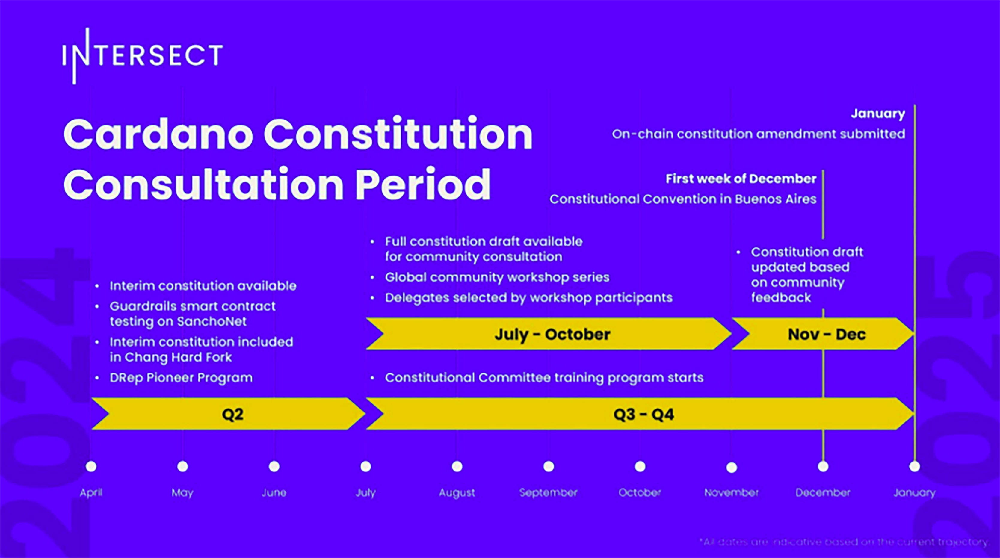

= TO DO:

- Update chapter up to Plomin hard fork
- move from googledoc to here
- Asciidoc format = https://gist.github.com/powerman/d56b2675dfed38deb298

A draft is in the doc linked below, shared with SMEs for review:
https://docs.google.com/document/d/1KygJtqqvUmdnHp5_6-JRy7EheBTsaphq/edit

= Chapter 5: Cardano governance 

IOG has been researching on-chain governance for some time, with a focus on this crucial area since the original https://why.cardano.org/en/introduction/motivation[Why Cardano] essay. Research papers dating back to 2017 have proposed a treasury for Ethereum Classic.footnote:disclaimer[Kaidalov, Kovalchuk, Nastenko, Rodinko, Shevtzov, Oliynykov (2017), ‘A proposal for an Ethereum Classic Treasury System’, iohk.io/en/research/library/papers/a-proposal-for-an-ethereum-classic-treasury-system/] Another paper, authored out of Lancaster University,footnote:[Zhang, Oliynykov and Balogun (2019), ‘A Treasury System for Cryptocurrencies: Enabling Better Collaborative Intelligence’, eprint.iacr.org/2018/435.pdf] explored the concept of a treasury system and a viable, democratic approach to long-term development financing for Cardano.

Formal methods, machine-comprehensible specifications, and integrating a treasury system with this process for financial incentives are just some of the solutions pursued. Let's discuss some of the mechanisms used to date to enable governance on Cardano. Each component complements the others, contributing valuable lessons and experience as the age of Voltaire unfolds. 

== Cardano Improvement Proposals (CIPs)

CIP stands for 'Cardano Improvement Proposals'. Similar concepts exist for other blockchains, such as the Bitcoin Improvement Proposals (BIPs) or the Ethereum Improvement Proposals (EIPs). While these share similarities, each works quite differently. In November 2020, http://github.com/cardano-foundation/CIPs/tree/master/CIP-0001[CIP-0001]  was drafted to explain what a CIP is. A CIP is a formal, structured document proposing a solution to a common problem, highlighting various solutions and their trade-offs. 

Anyone with ideas for enhancing Cardano can present them as CIPs. While CIPs are not a formal component of Cardano governance, they help steer the protocol and tooling in the right direction, benefiting the entire ecosystem. 

Technically, the first CIP was created in October 2019, which subsequently became https://cips.cardano.org/cip/CIP-1852[CIP-1852]. It extends http://github.com/bitcoin/bips/blob/master/bip-0044.mediawiki[BIP44] and documents how Cardano wallets manage keys and addresses. This document predates the formal CIP process. It was named CIP-1852 by Sebastien Guillemot after the year Ada Lovelace passed away, with her birth year, 1815, used in the cointype field. 

A CIP follows a standard format with a templated proposal structure that facilitates debate and evaluation. This structure allows community members to provide feedback on improvement recommendations or issues within a proposal. CIPs are stored as text files in a versioned http://github.com/cardano-foundation/CIPs[GitHub repository], where their revision history provides the proposal's historical record. For those not on GitHub, the auto-generated sister site, cips.cardano.org, serves as a user-friendly resource maintained by the Cardano Foundation.

Every CIP has the following format: 

* Preamble
* Abstract
* Motivation
* Specification
* Rationale
* Path to active
* Copyright 

The concept is developed as a written proposal and submitted as a pull request to the CIP repository after initial discussion and feedback. The updated draft CIP is then publicly processed as follows:

image::../images/5.1_cip_workflow.png[]

*Figure 5.1:* CIP workflow from CIP-0001

CIPs are processed in a semi-formal manner. Editors of CIP proposals meet regularly to discuss and evaluate ideas. Meeting http://github.com/cardano-foundation/CIPs/tree/master/BiweeklyMeetings[minutes] are publicly available, and meetings are held every two weeks. Authors are encouraged to contribute and provide comments, and discussions often take place simultaneously in the Cardano forum’s CIPs section and/or in GitHub pull requests. 

== Project Catalyst: democratizing innovation in Cardano 

https://projectcatalyst.io/[Project Catalyst], one of the world’s largest decentralized innovation funds, is a key component of the Cardano ecosystem. It aims to drive Cardano's evolution through community-driven funding and development initiatives to address real-world challenges. Catalyst empowers the Cardano community to propose, vote on, and fund proposals to foster innovation and growth within the ecosystem.

Launched in 2020, Project Catalyst represents a significant milestone in the Cardano roadmap. It reflects the project's commitment to decentralized governance and community empowerment and marks the transition from a research-driven initiative to a community-led innovation hub.

The primary goals of Project Catalyst are to:

* Foster innovation and development within the Cardano ecosystem
* Enable community participation in governance and decision-making
* Distribute funds transparently to high-potential projects that can solve real-world problems.

=== How Project Catalyst works

*The funding mechanism*

Project Catalyst's funding mechanism is designed to support various innovative projects within the Cardano ecosystem. It operates through a series of iterative funding rounds, known as funds, each with its own budget, themes, and goals.

The funds for Project Catalyst are sourced from the Cardano treasury. The treasury is replenished through a combination of:

* *Transaction fees*: a small fee collected from each transaction processed on the Cardano network.
* *Reserve funds*: Cardano allocated a portion of its initial supply to a reserve, contributing to long-term funding for ecosystem development. This ensures a sustainable and growing pool of resources to support ongoing innovation.

*Structure of funding rounds* 

Each funding round, or fund, operates cyclically, typically lasting several weeks to a few months. Each fund is identified numerically (eg, Fund1, Fund2) and has a defined budget. The structure of a funding round generally includes the following phases:

1. *Proposal submission*: innovators submit their project proposals on the https://cardano.ideascale.com/[IdeaScale platform]. Each proposal must align with the thematic goals set for that particular fund.
2. *Community review*: during this phase, the community reviews and provides feedback on the submitted proposals. This feedback helps proposers refine their ideas and improve their chances of success.
3. *Voting*: any ada holder can vote on proposals using the https://cardano.ideascale.com/[Catalyst voting application]. Voting power is proportional to the amount of ada held, incentivizing ada holders to participate actively in the governance process.
4. *Funding allocation*: based on the voting results, funds are allocated to the awarded proposals. Proposals with the highest votes receive funding until the budget for that fund is exhausted.

For more information about how Project Catalyst works, read the https://projectcatalyst.io/how-it-works[‘How it works’ section] on Project Catalyst’s website.

*Thematic goals and challenges for funding* 

Each fund is designed around specific themes or challenges that align with the strategic goals of the Cardano ecosystem. These themes guide proposers on the types of projects that are most needed and valued. 

Examples of thematic challenges might include:

* *DeFi solutions*: developing decentralized finance applications on Cardano
* *Community tools*: creating tools that support community engagement and governance
* *Educational resources*: developing educational content to onboard new users and developers.

*Proposal requirements* 

To ensure the quality and feasibility of the proposals, there are several key requirements that proposers must meet:

* *Clear problem statement*: proposals must clearly define the problem they intend to solve
* *Detailed solution*: a comprehensive explanation of the proposed solution, including its technical aspects and how it addresses the problem
* *Team information*: details about the team members, their backgrounds, and their roles in the project
* *Budget breakdown*: a transparent and itemized budget that outlines how the funds will be used.

You can review the latest proposals sent to Project Catalyst on the https://cardano.ideascale.com/c/home[‘Home’ section] of the IdeaScale website.

Voting process

Voting is a critical component of Project Catalyst, as it empowers the Cardano community to have a direct say in which proposals receive funding. This process ensures that decisions are decentralized and reflective of the community's collective priorities. Here’s an in-depth look at how the voting process works:

1. *Registration*. To participate in voting, ada holders must first register their wallets. The registration process involves taking a snapshot of their ada holdings at a specific point in time. This snapshot determines the voting power of each participant. You can find the latest list of supported wallets on https://docs.projectcatalyst.io/current-fund-basics/how-to-register-as-a-voter/wallet-registration-guide/supported-wallets[this page] of the Project Catalyst knowledge base.
2. *Getting a voting application*. Participants must use a dedicated voting application, such as the https://projectcatalyst.io/get-involved/become-a-voter[Catalyst Voting App], available on mobile devices. This application is designed to facilitate secure and user-friendly voting.
3. *Voting power calculation*. Voting power is directly proportional to the amount of ada held by a participant at the time of the snapshot. For example, an individual with 5,000 ada will have more voting power than someone with 500 ada. This system ensures that those with a larger stake in the network have a greater influence on funding decisions. Wallets with at least 500 ada, excluding rewards, are eligible to vote.
4. *Reviewing proposals*. All proposals are publicly accessible on the IdeaScale platform and the voting application. Participants can review detailed information about each proposal, including the problem statement, proposed solution, team details, and budget. Before voting, participants are encouraged to engage in discussions and provide feedback on the proposals. This collaborative approach helps refine the proposals and ensures that only well-vetted ideas move forward. To become a community reviewer, please https://docs.projectcatalyst.io/current-fund-basics/community-review-guidelines-fund12/how-to-become-a-community-reviewer[refer to this page] on the Project Catalyst knowledge base.
5. *Voting begins*. For each proposal, voters typically have multiple options to express their support or opposition. Common voting options include YES (strongly supporting the proposal) or ABSTAIN (choose not to vote). Only voting YES determines the outcome of proposals. Voting ABSTAIN is a signal only and serves to preserve privacy properties from cryptographic properties to counterbalance your YES votes. Your goal as a voter is to cast ABSTAIN in each category and mix up your voting profile to help improve voting privacy. Otherwise, not voting or choosing ABSTAIN are the same. However, ABSTAIN registers action on the chain. Not voting doesn't. Once you've cast a vote on blockchain, you cannot change it anymore.
6. *Counting votes*. After the voting period ends, votes are tallied. The proposals with the most votes are selected for funding until the budget for that funding round is exhausted.
7. *Announcing results*. The results are announced publicly, detailing which proposals have been selected for funding. This transparency helps build trust within the community.

After each funding round, feedback from the community is collected to identify areas for improvement in the voting process. Based on community feedback, enhancements are made to the voting process, such as improving the user interface of the voting application, increasing security measures, and refining the proposal evaluation criteria.

*Transparency and accountability*

Project Catalyst places a strong emphasis on transparency and accountability through the following measures:

* *Publicly accessible proposals*: all proposals and their progress are publicly accessible on the IdeaScale platform, allowing the community to track their development
* *Regular updates*: funded projects are required to provide regular updates on their progress, including milestones achieved and funds spent
* *Community oversight*: the community plays an active role in monitoring and evaluating the progress of funded projects, ensuring that funds are used effectively.

=== Success metrics in Project Catalyst

Measuring the success of Project Catalyst is essential to ensure that the initiative effectively fosters innovation and contributes to the growth of the Cardano ecosystem. The following metrics provide a comprehensive evaluation of its impact and effectiveness:

1. *Number of proposals submitted* 
  i) Description. This metric tracks the total number of proposals submitted in each funding round, reflecting the level of community engagement and interest in participating in Project Catalyst.
  ii) Importance. A higher number of submitted proposals indicates a vibrant, active community eager to contribute to the ecosystem's development. It reflects the diversity of ideas and innovations being brought forward.
  iii) Example. If Fund1 received 50 proposals and Fund2 received 150, it demonstrates a growing interest and increased participation over time.

2. *Number of proposals funded* 
  i) Description. This metric counts the number of proposals that successfully receive funding after the voting process.
  ii) Importance. It shows the proportion of ideas deemed valuable and viable by the community. It helps assess the effectiveness of the selection and funding processes in identifying high-potential projects.
  iii) Example. If 20 out of 100 proposals are funded in a given round, it reflects the competitive nature and high standards the community sets.

3. *Community participation in voting*
  i) Description. This metric measures the number of ada holders participating in voting.
  ii) Importance. High voter participation indicates robust community engagement and the legitimacy of the funding decisions. It ensures that the funded projects have broad support from the community.
  iii) Example. If 10,000 ada holders voted in Fund3 compared to 5,000 in Fund2, it indicates growing community involvement and trust in the voting process.

4. *Diversity of funded projects*
  i) Description. This metric examines the variety of projects funded across different categories, such as DeFi, community tools, educational resources, and more.
  ii) Importance. A diverse portfolio of funded projects indicates a balanced approach to ecosystem development, addressing various needs and opportunities within the    Cardano network. It prevents over-concentration on a single type of project, fostering a more resilient and versatile ecosystem.
  iii) Example. Funding five DeFi projects, three educational initiatives, and two community tools in one round may show a well-rounded investment in different areas.

5. *Impact of funded projects*
   i) Description. This metric evaluates the real-world impact and outcomes of funded projects, including their contributions to the Cardano ecosystem and broader blockchain space.
   ii) Importance. It assesses whether the projects deliver on their promises and generate value for the community. It helps identify successful initiatives that could serve as models for future projects.
   iii) Example. A funded DeFi project that significantly increases transaction volume and user engagement on Cardano would be considered a high-impact success.

6. *Budget utilization and efficiency*
   i) Description. This metric analyzes how effectively the funded projects utilize the allocated funds.
   ii) Importance. It ensures that funds are used as intended, projects adhere to their proposed budgets, and any issues of mismanagement or inefficiency are identified and mitigated.
   iii) Example. A project that delivers its milestones within the allocated budget demonstrates effective use of funds, whereas overspending might indicate potential issues.

7. *Community feedback and satisfaction*
   i) Description. This metric gathers feedback from the community regarding their satisfaction with the funded projects and the overall Project Catalyst process.
   ii) Importance. High satisfaction levels indicate the community's needs and expectations are being met. It provides insights for continuous improvement of the Project Catalyst process.
   iii) Example. Positive feedback on the transparency and impact of the voting process would highlight the community's approval, whereas constructive criticism could guide future enhancements.

8. *Growth in Project Catalyst participation*
   i) Description. This metric tracks the growth in the number of participants in Project Catalyst, including proposers, reviewers, and voters.
   ii) Importance. It reflects Project Catalyst's expanding reach and inclusiveness. It also indicates the initiative’s ability to attract and engage a broad spectrum of participants over time.
   iii) Example. An increase in active users on the IdeaScale platform and the voting application from one funding round to the next indicates growing engagement.

9. *Long-term sustainability and scalability*
   i) Description. This metric assesses Project Catalyst's long-term sustainability and scalability, including its capacity to manage growing numbers of proposals and participants.
   ii) Importance. It ensures that Project Catalyst can continue to function effectively as it grows. Also, it addresses any potential bottlenecks or challenges related to scaling the initiative.
   iii) Example. Implementing and effectively utilizing new tools and processes to manage more proposals and votes without compromising quality or security.

By carefully monitoring these success metrics, Project Catalyst can ensure it meets its goals of fostering innovation, supporting valuable projects, and effectively engaging the community. Continuous assessment and refinement based on these metrics will help Project Catalyst remain a dynamic and impactful component of the Cardano ecosystem. The *Catalyst* team released their http://projectcatalyst.io/reports/horizons.pdf[Catalyst Horizons report] documenting various milestones. To dig deeper into the stats and trends, visit the https://projectcatalyst.io/reports[Reports] section of projectcatalyst.io for the latest data.

== The age of Voltaire

As Catalyst took a ‘tactical pause’ break after Fund9, there was a timely Systemization of Knowledge (SoK) research paperfootnote:[Kiayias, Lazos (2022), 'SoK: Blockchain Governance', arxiv.org/pdf/2201.07188.pdf] published just around this same time, reflecting on the state of governance in ten blockchains, including Bitcoin, Ethereum, and Cardano.

The paper lists *seven properties* to assess different requirements for effective blockchain governance: 

1. *Suffrage*: this property deals with participation eligibility. How inclusive is the governance mechanism? 
2. *Confidentiality*: are decision-makers’ inputs protected from ‘external influences’? 
3. *Verifiability*: can decision-makers confirm their input has been considered in the output?
4. *Accountability*: are decision-makers held accountable for their input?
5. *Sustainability*: are decision-makers suitably incentivized?
6. *Pareto efficiency*: how effectively can decision-makers' intentions be turned into actions?
7. *Liveness*: how quickly can a blockchain’s governance mechanism produce outputs efficiently?

image::../images/5.2_governance_properties.png[]
*Figure 5.2:* The partition map of governance properties from the ‘SoK: Blockchain Governance’ paper

The paper concludes that while each blockchain displays some of the properties, no blockchain meets all the requirements for effective governance. It was food for thought just before the dawn of the _age of Voltaire_. 

*CIP-1694*

https://cips.cardano.org/cip/CIP-1694[CIP-1694] was named after Voltaire’s year of birth. It is arguably the most important CIP to date as it is a proposal to bootstrap the age of Voltaire. Co-authored by Charles Hoskinson, it is the first CIP he has gotten directly involved with. It’s clear a lot of thought went into it, and it’s intentionally written as a transitional, living document.

When Cardano was formed, there was a tripartite structure with Emurgo, the Cardano Foundation (CF), and IOG with remits for ecosystem growth, governance, and engineering, respectively. The intention was always to move to a members-based organization (MBO) that would manage the protocol governance. 

CIP-1694 is the fruit of years of research. IOG has been working on a decentralized update system for some time. For example, they wrote a paper _Updateable Blockchains_ footnote:[Ciampi, Karayannidis, Kiayias and Zindros (2020), 'Updatable Blockchains', iohk.io/en/research/library/papers/updatable-blockchains/] with the European Union, with a Horizon 2020 grant, to explore ways to implement this vision. 

Early in 2022, IOG and the CF held workshops to hammer out a way forward for the Voltaire development phase. The first question was ‘What is good governance?’. Charles Hoskinson explained in his ScotFest keynote that the answer was based on three different categories:

1. The *concept of representation* involves consent regarding decision-making authority. There are two types: *direct representation*, where individuals vote personally, and *delegated authority*, where individuals hand their vote to someone else. In CIP-1694, this role is called a delegate representative (DRep). This concept was already introduced in a similar form in Project Catalyst. 

2. Governance requires a set of rules, often called a constitution, which serves as guardrails to provide stability. In a blockchain context, a constitution can be machine-readable. Formal specifications can act as blueprints for Cardano, enabling integration with an update system. Once a voting system is established, the constitution can be ratified, hashed, and embedded in a transaction. This allows users to sign a type of ‘end user agreement’ by signing the transaction.

3. *Institutions* are often seen as targets for decentralization. If the goal is to ‘kill the middleman’, why do institutions matter? At their best, institutions set standards and provide a review process conducted by domain experts. Institutions are essential for good governance as they are the custodians of knowledge and best practices. People can be biased, so objective, neutral bodies are sometimes necessary for guidance. After careful consideration, it was determined that the most important ‘anchor’ institution would be a *members-based organization* (MBO) which should operate similarly to other open-source initiatives like the Linux Foundation, or the Cloud Native Computing Foundation (CNCF).

*What is an MBO?*

The MBO is a central hub that unites different groups, including thousands of stake pool operators, Cardano ambassadors, open-source projects running on Cardano, IOG, CF, Emurgo, and all ada holders. Members will own and run the MBO, staffing the steering committees. 

image::../images/5.3_gov_concepts.png[]
*Figure 5.3:* Governance concepts defined, based on the slide from ScotFest 2022

The MBO, later christened _Intersect_, is Voltaire's anchor institution, but it is not the only one. IOG has been steadily building out its presence in universities all over the globe, as well as opening the Hoskinson Center for Formal Mathematics, the Zero-Knowledge Lab not forgetting the Edinburgh Decentralization Index (EDI).  Other institutions and MBOs will follow with different focuses and priorities.  

  _‘Institutions… their only job is to take complexity and turn it into simplicity’_ – Charles Hoskinsonfootnote:[Charles Hoskinson: Crypto regulations & policy, Importance of stablecoins & the future of Cardano, youtu.be/uEV8tQ6z87k?si=iVazdagl5JWZez3q&t=1983]

CIP-1694 could fill a book on its own and, like all CIPs, is a living document that evolves with feedback. It aims to bootstrap the Voltaire development phase, integrating on-chain and off-chain components for ecosystem self-governance. The ultimate aim is a fully end-to-end, on-chain governance layer for Cardano.

*Where we came from – the five out of seven system*

Before the Chang hard fork, governance transactions (eg, hard forks, parameter changes, etc) required a signature from at least five out of the seven Cardano governance (genesis) keys, currently held by the three founding entities. This process was always intended to be an ephemeral form of governance as we got through the earlier phases of the roadmap before Voltaire. There have traditionally been just two types of governance transactions:

Protocol parameter updates using transaction http://github.com/input-output-hk/cardano-ledger/blob/8884d921c8c3c6e216a659fca46caf729282058b/eras/babbage/test-suite/cddl-files/babbage.cddl#L56[field nº6 of the transaction body]
Movements of the treasury and the reserves using Move Instantaneous Rewards (MIR) certificates.

*Where we are going*

The current proposal encompasses two new ledger eras. The first era is called Conway, after the celebrated English mathematician John Horton Conway. The current plan for the Conway ledger era is to:

* introduce SPO voting for hard forks 
* provide an on-chain mechanism for rotating the governance keys
* rewire the ledger rules involving governance as outlined in CIP-1694.

For CIP-1694 to succeed, it is essential to realize the vision presented in the _Road to a Polyglot Ecosystem for Cardano_ whiteboard http://youtube.com/watch?v=skcCg1WaedA[video]. The new governance mechanisms will support multiple clients, enabling different development teams to employ different approaches, programming languages, and commercial unique selling propositions (USPs). 

Charles Hoskinson’s keynote at ScotFest 2022:footnote:[ IO ScotFest Keynote with Charles Hoskinson, youtu.be/tbtkClr3Y3I]

  _‘So that's Voltaire …it’s deeply philosophical, it's the hardest thing I've ever done in my life, it's the hardest thing you're ever going to do in your life, and we're going to get it done, because it needs to get done and I'm damn tired of our industry failing, and it's about time we can point to something and say ‘you know what, we did it the right way’. We have to tend to our own gardens first. That was a lesson of Candide. So we have to fix Cardano's governance before we have the right to complain about any other person's governance.’_ 

2023 was all about debating how to implement CIP-1694. The CIP was written in a deliberately high-level, approachable format to stimulate discussion and feedback. The community did not disappoint with 50 http://cip1694.intersectmbo.org/[workshops], 30 in-person and 20 online, with over 1,000 participants from 20+ countries. 

In addition to community-led workshops, IOG, EMURGO, and the Cardano Foundation co-hosted three governance workshops. The CF workshop took place in Zug, Switzerland, in June, followed by EMURGO’s workshop in Tokyo, Japan. The final workshop, hosted by IOG in Edinburgh in July 2023, marked the conclusion of the CIP-1694 design feedback loop.

Dozens of blogs have been written, and contentious issues have been argued over Reddit, X (Twitter), and Telegram. It is impossible to acknowledge every voice here, but you can dig into the finer detail by following Nicolas Cerny’s http://forum.cardano.org/t/cardano-governance-updates-community-input-voltaire-phase-and-CIP 1694-updates/115878[diary of events] on the Cardano Forum. 

Governance on Cardano hit a milestone on Friday, June 30, 2023, when the https://github.com/cardano-foundation/CIPs/pull/380[CIP-1694 pull request] was merged into the main branch of the Cardano Foundation CIP repository. The proposal’s status advanced to the ‘Proposed’ stage.

As almost everything in Cardano takes the form of a transaction, getting the metadata standard correct is critical. Metadata allows developers to embed information specific to the context of the transaction. For example, the NFT standard (see https://cips.cardano.org/cip/CIP-0025[CIP-25], https://cips.cardano.org/cip/CIP-0068[CIP-68], https://cips.cardano.org/cip/CIP-0060[CIP-60]) on Cardano has evolved with new capabilities, unlocking with each roadmap release. Pi Lanningham authored http://github.com/cardano-foundation/CIPs/pull/556[CIP-0100] to clear up what metadata standards need to be introduced to enable the on-chain governance mechanisms proposed in CIP-1694.  

http://cips.cardano.org/cip/CIP-0095[CIP-95] is a crucial CIP, which extends CIP-30 and describes the interface between webpage/web-based stacks and Cardano wallets. More specifically, it is a specification that defines the API of the JavaScript object that is injected into web applications. The CIP enables voting capabilities for governance tools. At the Edinburgh hackathon, decisions were made around open http://github.com/Ryun1/CIPs/blob/governance-wallet-connector/CIP-0095/README.md#open-questions[questions], and the base design was approved. 

As governance can be subjective, it's best you read CIP-1694 yourself, especially the Rationale and Changelog sections, which add context. If 2023 was the year we discussed governance, 2024 was all about implementation with Intersect as the main driving force. 

== Intersect: shaping Cardano's future

Intersect is a members-based organization for the Cardano ecosystem, founded in 2023. It serves as an aggregation point for the entire Cardano community, placing the community at the heart of Cardano’s future development and harnessing the untapped potential of collective wisdom and economic energy. Intersect brings together companies, developers, individuals, institutions, and other ecosystem participants to shape and drive the future development of Cardano. It acts as a steward of the underlying blueprints and technology for the community, beginning with the Cardano node, core technology libraries, and components required to operate the protocol, along with all of its accompanying documentation, knowledge, and contributors.

This governance structure is designed to enhance decentralized growth within the Cardano ecosystem. It enables community-driven decision-making through democratic voting, defines clear roles and responsibilities, and ensures accountability. The MBO manages funds for ecosystem projects, aligns efforts with long-term strategic goals, and fosters inclusive community participation. It also improves coordination, increases accountability, and supports sustainable growth by providing a structured yet decentralized framework. Implementation involves community consensus, framework development, regulatory compliance, securing funding, and ongoing management. This model empowers the Cardano community and aligns with its vision of decentralization and transparency.

https://www.intersectmbo.org/[Intersect] empowers a distributed network of builders and contributors who believe that every voice holds value and that collaboration leads to stronger outcomes. Members forge a secure, collaborative ecosystem to ensure Cardano's sustained growth and evolution in a safe space.

=== How Intersect operates

Intersect aims to administer the governing processes for Cardano’s continued roadmap and development of the Cardano protocol. Intersect is currently facilitating the rollout of Cardano’s groundbreaking governance features. Visit the Intersect latest https://www.intersectmbo.org/news[news] page to keep up to speed with the latest developments. 

All Cardano ecosystem participants are welcome to become Intersect members. Made up of a distributed group of participants, including the foremost experts on Cardano and current ecosystem contributors, Intersect aims to facilitate healthy discussions and sound decision-making amongst its members and the community to uncover pain points and champion successes.

*The five pillars of Intersect*

1. *Community support*: this involves hosting events, hackathons, and conferences designed explicitly for developers within the Cardano ecosystem
2. *Governance*: Intersect champions and oversees Cardano's community-driven governance system, implemented through CIP-1694
3. *Technical roadmap*: following community approval, Intersect helps orchestrate the delivery of the Cardano technical roadmap
4. *Continuity*: to ensure system stability, Intersect facilitates Cardano's ongoing continuity
5. *Open-source development*: Intersect plays a role in coordinating the open-source development of Cardano's core technologies.

*Intersect* has a central governing board, similar to a city council, chosen and managed by its members. This board is supported by various committees and working groups, each focusing on specific areas or interests within the Cardano ecosystem. With its diverse global membership, this structure allows Intersect to effectively identify key goals for Cardano's development.

Intersect's governing board starts with five seats. Three are filled by founding members (seed funders, Input Output Global, and EMURGO), with the Intersect chief operating officer (COO) holding a temporary seat. Another seat is offered to the University of Wyoming's Blockchain Center for a one-year term.

The remaining two permanent seats will be filled later in 2024 by Intersect members through an election process that will be designed collaboratively.

A new advisory board will be created with member input to find the best people for the remaining board seats. This group will also explore how to hold elections for future committees. The board meets monthly and publishes agendas and https://intersect.gitbook.io/intersect-board[minutes] for transparency, and can be contacted at board@intersectmbo.org.

A community working group was formed in January 2024 to support transparency. This group observes board meetings and gathers community feedback to ensure Intersect meets members' needs. 

*Intersect's funding*

Intersect uses funding to promote open and accessible systems through technology and education and to shape Cardano's development. This includes running Intersect itself and supporting the open-source development of Cardano's technology.
Input Output Global and EMURGO initially funded Intersect to get things running. For future funding, the community will be asked to vote on using funds from the Cardano treasury or explore other options.
Maintaining and improving Cardano requires ongoing costs. For 2024, Input Output Global and EMURGO have provided funding to cover these operational costs. This allows a group of members to continue providing essential technical services. Intersect created the Cardano development trust (DevTrust) to manage these initial funds. This trust can only use funds to benefit Cardano, such as funding ongoing development and honoring existing agreements. Intersect manages the DevTrust to ensure these funds are used appropriately and to generate income to support its operations.

Becoming a founding member comes with the following benefits:

- Participate in steering groups, committees, and advisory boards, with the potential to establish new committees that will define Cardano's future governance
- Access grants and contribute to developing Cardano's codebase while guiding a grant program to strengthen the Cardano protocol and ecosystem
- Collaborate with other Cardano enthusiasts to build new partnerships and connections
- Showcase contributions through member events, conferences, marketing materials, and member spotlights
- Attend monthly meetings for updates on progress, committees, events, and funding opportunities 
- Participate in the annual meeting (in-person or virtually), focusing on Intersect activities, including voting on proposals. There are many https://intersect.gitbook.io/intersect-community-grants/overview/community-hub-faqs[Community Hubs], located worldwide, hosting events.

*Amending Intersect membership governance*

Proposals to change Intersect's membership governance must be clearly documented. The board can approve amendments by a simple majority vote. There are various streams regarding the ongoing work that maintains and improves Cardano.
Think of ‘*continuity*’ as the essential technical services needed to keep Cardano running smoothly. This includes bug fixes, upgrades, and new developments like CIP-1694. In the first quarter of 2024, Intersect signed several contracts to deliver features and functionalities through continuity efforts. It's important to note that continuity focuses on the core infrastructure and many other exciting community projects and applications are being built on top.

*Cardano's vision and backlog* refer to Cardano's future development, including new features and functionalities. These features may still be in the research phase or identified by the community for further exploration.

*Open-source development*

Cardano is an open-source project, with over 40 code repositories maintained by Intersect and its members. You can find more information and explore these repositories on https://github.com/IntersectMBO[GitHub].  

True open source means having the flexibility to choose different options. The Cardano Foundation also follows an open-source strategy. http://cardanofoundation.org/en/news/accessing-cardano-blockchain-data-with-ledger-sync/[Ledger Sync], http://identity.cardanofoundation.org[Identity Wallet], Aiken, http://github.com/CardanoSolutions/kupo#readme[Kupo], and http://ogmios.dev/[Ogmios] all follow open-source principles and make life easier for developers on Cardano. 

Acknowledging that Java is still the preferred language for many enterprise developers, the CF created Ledger Sync and the Identity Wallet in Java as open-source tools with this audience in mind. Ledger Sync puts sequential blockchain data in a new, more accessible database structure, while the Identity Wallet is a W3C-compatible mobile wallet for managing self-sovereign identities across Cardano and other blockchains. The wallet supports multiple standards, integrating key event receipt infrastructure (KERI) for interoperability to fit a broad range of use cases and enterprise adoption.

In addition, The Cardano Ballot project, a http://github.com/cardano-foundation/merkle-tree-java[Merkle Tree] in Java/Aiken, the Cardano conversions http://github.com/cardano-foundation/cf-cardano-conversions-java[library], and state channels layer 2 (hydra-java http://github.com/cardano-foundation/hydra-java[Client]) were all made open source. The CF also made the http://cardanofoundation.org/en/news/releasing-an-open-source-rewards-calculation/[rewards calculation] open source to enable anyone to perform and validate the rewards calculation independently of a single implementation. 

*Open source office (OSO)*

The OSO manages Cardano's open-source program and community. They ensure open and effective communication with the wider open-source community. Intersect manages contracts with companies working on Cardano's development, acting on behalf of DevTrust.
Intersect handles all aspects of supplier contracts for DevTrust. This includes negotiating terms, managing the agreements, and overseeing the work. Intersect ensures the contracts align with DevTrust's goals and that companies meet their obligations. They also monitor progress and take steps to optimize efficiency and keep the community informed.

*Delivery assurance*

Delivery assurance ensures that projects are completed on time and according to specifications. This involves managing risks, tracking progress, and taking action to ensure successful completion. The approach varies based on the project's size, complexity, and potential risks.

Led by the _technical steering committee_ (TSC), Intersect's delivery assurance team plays a vital role. This team works on behalf of the Cardano community to guarantee that Cardano's development plan stays on track.

== Intersect committees

Intersect operates on the principle of community leadership for Cardano's development. This is achieved through standing committees formed by and led by its members.

*Standing committees* are permanent committees covering various functions critical to guiding Cardano's ‘continuity’ (ongoing maintenance and development), shaping Cardano's constitution, and supporting internal membership needs. While changes can be made as the committees and their goals evolve, they are intended to be long-lasting. The governing board will provide support and review any proposed adjustments.

*Working groups* are temporary and typically support a standing committee's broader objectives. They may also be formed to tap into expertise outside of Intersect's membership. Flexible and less formal than committees, working groups can address diverse topics relevant to Cardano's development. For example, the _marketing working group_ was formed by creatives and marketers who felt it was an area Cardano could improve upon. The group meets weekly and is active on https://discord.com/channels/1136727663583698984/1240228290799865878[Discord].

=== The civics committee
The civics committee acts as a guide and supervisor for the Cardano community on governance issues: 

- They develop and manage ways for the community to actively participate in Cardano's governance
- They collaborate with subject matter experts when needed
- They assist the Cardano constitutional committee as requested.

This committee is crucial for ensuring Cardano's governance system is:
- Accessible: easy for everyone to understand and participate in
- Fair: upholding equal rights and opportunities for all community members
- Transparent: open and clear communication about all governance processes.

The _civics committee_ addresses topics like:

- *Ratifying the constitution*: facilitating a period for community approval of the Cardano constitution
- *Off-chain discussions*: tracking and maintaining a record of informal discussions about proposals before they are formally presented
- *On-chain voting tools*: monitoring these tools to ensure they are functional and well-maintained
- *Voting guidelines*: developing and updating clear instructions and best practices for on-chain voting
- *Governance improvements*: providing non-binding recommendations based on community input to enhance Cardano's governance system.

=== Membership and community committee (MCC) 
The MCC helps build a strong Cardano community within Intersect. They achieve this by:

* Attracting new members through effective sales and account management
* Supporting existing members through helpful resources and events
* Offering https://docs.intersectmbo.org/intersect-community-grants/open-grants[grants] for creating useful community tools
* Providing education and hosting engaging events.

This committee creates a space for Cardano enthusiasts to connect, share knowledge, and collaborate on projects. For example, a grant was awarded to Ryan Wiley for his ‘Cardano Governance Minimum Attack Vector (MAV) Dashboard’. This tool displays real-time governance action data through donut charts, breaking down participation in governance actions by DReps, SPOs, the CC, and an aggregated total of all groups. This highlights which entities sway over each proposal type based on stake-weighted delegation and voting thresholds. Anyone in the Cardano ecosystem can flag specific centralization concerns with this user-friendly dashboard.

The MCC manages Intersect memberships, ensuring everyone gets the most out of the program and can contribute to Cardano's development. They also review proposals for community working groups.
Want to learn more or join the MCC? Email them at membership-and-community-committee@intersectmbo.org. They hold public meetings every four weeks, and their minutes are https://intersect.gitbook.io/community-and-membership-committee/[public]. Check out the MCC terms of reference https://docs.google.com/presentation/d/1gvaSrd7tJ6B5e0JIwaus0Yj6DXDcENT3gJwPCad83NQ/edit#slide=id.g2422287dda8_0_0[(ToR)] for a deeper dive.

===The technical steering committee (TSC)

The TSC oversees Cardano's technical health, ensuring that decisions are based on solid technical knowledge and best practices.

This committee brings together key players to ensure Cardano's development runs smoothly. They handle contracts with developers, create technical proposals, and review ideas from the Cardano community, like updates or major changes to the network.

The TSC leads in guiding the development of Cardano's ongoing technical foundation. They provide in-depth technical analysis and advice for everything from development projects to network settings. Think of them as the guardians of Cardano's technical well-being. The minutes from their meetings are https://intersect.gitbook.io/technical-steering-committee/tsc-meeting-minutes[public]. Check out the https://intersect.gitbook.io/technical-steering-committee/[Intersect GitBook] for further details on the TSC and its working groups.

=== The parameter committee (PC)

The PC is a team within the TSC that focuses on optimizing Cardano's settings. They ensure these parameters are set based on the best technical knowledge available.
This committee plays a crucial role in maintaining Cardano's long-term health. They consider factors like economics, security, and network performance when recommending updates to Cardano's core settings.

The PC delves into Cardano's parameters, including technical settings, network behavior, and economic factors. They meet regularly to discuss updates and consider proposals from the community to adjust these parameters.

Membership in this technical group is by invitation only. However, anyone can submit suggestions for parameter changes on the Cardano Forum. The PC also participates in monthly calls with Cardano's stake pool operators to share updates and answer questions. 

Matthew Capps’ http://twitter.com/cryptstitution/status/1725745468821344432?s=46[X thread], _Protocol Change Proposal-001: Chronology of Documented Events_, provides insight into the careful consideration and deliberation involved in a parameter change.

To learn more, check out the https://intersect.gitbook.io/parameter-committee-knowledge-base/[meeting notes] and learn how to submit parameter change proposals on the https://forum.cardano.org/c/governance/parameters-committee-updates/220[Cardano Forum].

=== The open source committee (OSC)

The OSC owns the roadmap (strategy) for Cardano's open-source projects, advising others on open-source best practices, and acts as a central point for anyone building within Cardano's open-source environment.

This committee helps developers navigate the world of open-source development on Cardano.

The OSC tackles several key areas:
* Defining what ‘open source’ means for Cardano projects
* Developing and maintaining Cardano's open-source strategy
* Overseeing pilot projects for open source on Cardano
* Establishing best practices for open-source development within Cardano
* Creating a model for future open-source projects within Intersect.

The OSC was the first Intersect committee and is currently chaired by Tweag. Anyone can join the OSC's https://meet.google.com/eeb-qjbx-agw[weekly public call] on Fridays (8-9 AM PST) to learn more and ask questions. They also have a Discord channel (#osc-feedback) for ongoing discussions.

Check out the latest https://intersect.gitbook.io/open-source-committee/[meeting notes], their governance https://github.com/IntersectMBO/documentation/blob/master/open-source-committee/policies/governance.md[policy], and a community-drafted https://github.com/IntersectMBO/documentation/pull/2[voting procedure proposal].

=== Cardano budget committee

A _budget committee_ aims to manage Cardano's operational costs. This committee creates a yearly budget for community review and approval. The committee provides clear information on Cardano's core expenses, ensuring transparency for the community.

How it works:

* The _Product committee_ provides a list of approved projects
* The _budget committee_ will then assign costs to these projects and create a budget proposal
* The community will vote on the budget proposal at the annual members meeting (AMM)
* Upon approval, funds will be allocated from the Cardano treasury through on-chain voting.

The initial Cardano budget will be presented before the AMM for community review and voting. On-chain ratification will follow after the AMM vote.

image::../images/5.4_provisional_budget_process.png[]
*Figure 5.4:* Provisional Budget process timeline 

=== Product committee  
The product committee manages and tracks the roadmap for development items. Their responsibilities include:

* Continuity, in other words, maintenance, upgrades, and core development, feature requests
* Research. 
* Marketing, promotion, or other non-technical categories.

The community are encouraged to submit projects for consideration for the 2025 roadmap, with an https://committees.docs.intersectmbo.org/intersect-technical-steering-committee/technical-roadmap/how-to-participate-in-shaping-the-technical-roadmap[explainer] to guide them through the process.

=== Working groups

Intersect forms temporary groups called working groups to address specific needs as they arise. These groups can focus on any topic and operate less formally than the permanent committees.

* Each working group defines its purpose, operating procedures, and member roles and responsibilities in a terms of reference document
* Participation limitations, like application processes or elections, are set with board approval
* Meeting frequency and procedures are also established
* Each working group works under a specific committee but may collaborate with others
* They report their progress and findings to their overseeing committee(s).

To learn more, head over to the Intersect https://intersect.gitbook.io/intersect-working-groups/[working groups space] for a complete list and further details.

Towards the end of 2024, Intersect held elections for open positions for the various committees and boards. The successful candidates were:

* *Intersect board* -  Kavinda Kariyapperuma, Adam Rusch
* *Intersect steering committee* - Yuki Oishi, Kevin Hammond
* *Budget committee* - Mercy Fordwoo, Jose Velazquez, Kristijan Kowalsky, Pepe Otegui
* *Cardano civics committee* - Reshan Fernando, Taichi Yokoyama, Eystein Magnus Hansen, Daniela Alves
* *Membership and community committee* - Sanjaya Wanigasekera, Matthew Capps, Ha Nguyen, Akheel Fouze, Darlington Wleh
* *Open source committee* - Adam Dean, Johnny Kelly, Sebastian Pabon, Pedro Lucas
* *Product committee* - Naushad Fouze, Samuel Leathers, Juan Sierra, Kyle Solomon
* *Technical steering committee* - Adam Dean, Kevin Hammond, Markus Gufler, Ben Hart, Johnny Kelly 

=== DRep education

Intersect is collaborating with the IOG education team on the https://sancho.network/drep-pioneer-program/drep-pp/overview[DRep Pioneer program], an online interactive training course for nominated delegate representatives (DReps) involved in Cardano’s proposed governance structure.

These DRep leaders are true pioneers, playing an important role in educating the community about decentralized governance for Cardano. As instructors, they will train individuals from the Cardano community interested in becoming DReps.

DReps will leverage the voting power of multiple ada holders and ensure that everyone can truly contribute to shaping the protocol's future.

Intersect was inundated with applications from candidates. After a meticulous selection process, the initial cohort was announced. Pedro Lucas, Martin Musagara, Ha Nguyen, Cameron Smith, Joao Bosco Ribeiro, Reshma Mohan, Daniela Alvez, Phil Lewis, Eystein Magnus Hansen, Ubio Obu, Jaromir Tesar, Adam Rusch, Jenny Brito, Hosky and Wada Global Ltd represent the diversity of the global Cardano ecosystem.

Intersect member https://www.lidonation.com/[LIDO Nation] created the DRep Campaign Platform hosted at http://sancho.1694.io/dreps[sancho.1694.io/dreps] which enables DReps to create off-chain profiles linked to their on-chain actions to campaign for delegation from Ada Holders. 

=== Get involved

All Cardano ecosystem participants are welcome to https://www.intersectmbo.org/join[join] Intersect as members. Intersect consists of a distributed group of participants, including leading experts on Cardano and active ecosystem contributors. Its goal is to facilitate healthy discussions and sound decision-making among its members and the broader community, to both uncover pain points and champion successes. Intersect members are also encouraged to join the various working groups. 

Intersect members can apply for grants to support specific projects and initiatives related to the continuity and development of Cardano. With CIP-1694, the initial focus of these grants will be on enhancing governance in the age of Voltaire for the Cardano ecosystem.
Given the many moving parts within Intersect and the rapid pace of updates, members can stay informed following the https://docs.intersectmbo.org/intersect-overview/intersect-development-updates[weekly development updates]. 

== Cardano's evolving governance: a three-part approach

Cardano's future governance leans on three key pillars:

1. *On-chain decisions*: this system (detailed in CIP-1694) allows ada holders to directly influence Cardano's development through proposed governance actions voted on-chain
2. *Cardano constitution*: this evolving document outlines core rules to guide Cardano's growth during its transitional governance phase. A fully-fledged constitution will be drafted with community input throughout the year, culminating in a final version ratified by both delegates and ada holders. https://github.com/Ryun1/CIPs/tree/cip-constitution-tech/CIP-0120[CIP-0120 (constitution specification)] proposes a standardized technical format to make the document accessible for tools to read, render, and write. 
3. *Institutions*: these provide spaces for discussion, collaboration, and recommendations that ultimately feed into on-chain decision-making.

These three elements work together to create a robust governance system that can adapt and improve over time, driven by the Cardano community. The age of Voltaire is still in its infancy, and four key roles will be pivotal as CIP-1694 becomes a reality.

*Ada holders*
Ada holders play a crucial role in Cardano's governance. They can:

* *Delegate their vote*: choose representatives (DReps) to cast votes on their behalf
* *Become a DRep*: represent themselves or others in on-chain voting
* *Shape Cardano's future*: propose changes to the network by submitting on-chain governance actions
* *Stay informed*: review submitted governance actions and cast their vote on them.

By actively participating, ada holders collectively drive Cardano's development.

*DReps*

The _age of Voltaire_ introduced delegate representatives (DReps), a new concept central to Cardano’s governance as defined in CIP-1694. DReps, alongside stake pool operators and the constitutional committee, will vote on proposals that shape Cardano's future.

Any ada holder can become a DRep. This means ada holders can choose to directly participate in voting or delegate their voting power to DReps they trust. There are two predefined DReps: the _abstain_ and the _no confidence_ DReps. These options allow ada holders to either not participate in governance or automatically express a yes vote on any _no confidence_ action, providing a directly auditable measure of confidence in the constitutional committee.

*Why delegate?* 

Delegation allows ada holders to empower representatives who are potentially better equipped to make informed decisions on their behalf. This fosters a more democratic system where everyone has a say, even if they don't have the time or expertise to delve into every proposal.

The first community DRep workshop took place on January 20, 2024, in Oslo. This initiative was funded by a Catalyst Fund10 https://projectcatalyst.io/funds/10/f10-drep-improvement-and-onboarding/drep-recruitment-training-and-ethical-code-development-workshops[proposal] from Eyetein Hansen, Adam Rusch, Ekow Harding, Jose De Gamboa, Thomas Lindseth, and Yuki Oishi. Many more workshops followed. 

*Stake pool operators (SPOs)* 

Think of SPOs as the caretakers of Cardano's network. They run stake pools, which are essentially servers that keep the blockchain running smoothly. These operators typically:

* Own or rent servers running the Cardano node (both block-producing and relay nodes) 
* Hold the pool's key
* Maintain and monitor the network nodes.

SPOs play a vital part in Cardano's on-chain voting governance by:

* *Proposing changes*: they can submit governance actions to improve the network
* *Shaping the future*: they can review and vote on proposed governance actions.

*The constitutional committee (CC)* 

Unlike other Cardano governance bodies, the CC operates independently and entirely outside of Intersect. It is one of three key groups (alongside SPOs and DReps) that vote on proposals to change Cardano's core systems through governance actions. The CC's primary function is to review proposed changes with a limited focus: ensuring that they align with the principles outlined in Cardano's constitution.

== Cardano governance flow

CIP-1694 outlines Cardano's on-chain governance process, but it's also important to consider the supporting off-chain activities. 

*Off-chain proposal discussions* 
Before proposals are submitted to the blockchain for official votes, there is a crucial off-chain stage for discussion and refinement. Off-chain debate allows for:

* *Clearer proposals*: proposers can share more details, rationale, and supporting evidence to ensure everyone understands the idea
* *Community input*: reviews, comments, and feedback help improve the proposal and gauge overall sentiment
* *Informed voters*: off-chain discussions generate valuable context, which becomes part of the official proposal (metadata) on-chain, aiding voters in making informed decisions
* *Reduced burden*: filtering and refining proposals off-chain minimizes the number of votes submitted on-chain, reducing stress on the blockchain.

Without a strong off-chain process, governance could falter, as ideas may not undergo thorough discussion or refinement. On-chain proposals might lack the necessary context, making informed voting difficult.

Intersect recognizes the importance of off-chain discussions and has issued a grant to establish a dedicated proposal discussion forum. More information about the grant can be found in https://intersect.gitbook.io/intersect-community-grants/cohort-2/proposal-discussion-forum[Intersect's GitBook].

*Submitting on-chain governance actions*

Once a proposal has been thoroughly discussed and refined off-chain, it is ready for the official vote on the blockchain. This is known as on-chain governance action submission. Proposals can be submitted on-chain through the Cardano command-line interface (CLI) or via GovTool’s user-friendly interface. The specific content required for an on-chain proposal depends on the type of governance action being submitted. Proposers can optionally add metadata to provide additional context and information alongside the proposal. 

== Registering as a DRep on-chain

DRep registration occurs on the blockchain and can be done through the Cardano CLI or GovTool. During registration, DReps can optionally add details about themselves (metadata) to help ada holders decide who to delegate their votes to.

Intersect recognizes the importance of a strong DRep system and has issued a https://intersect.gitbook.io/intersect-community-grants/cohort-2/drep-campaign-platform[grant] to establish a DRep campaign platform. 

*On-chain DRep delegation*

On-chain delegation allows ada holders to give their voting power to a DRep of their choice. These DReps then cast votes on their behalf regarding active governance actions.

To make an informed decision, individuals should review the metadata submitted by DReps during registration. This metadata might include details like their expertise, areas of interest, and even past voting history.

The delegation process happens on the blockchain and can be done through the Cardano CLI or GovTool.

*On-chain voting process* 
On-chain voting is where the three voting groups (DReps, SPOs, and the CC) cast their votes on active governance actions.

For a proposed governance action to be approved and implemented, it needs to meet specific voting thresholds set by Cardano. These thresholds may vary depending on the type of governance action being voted on. In simpler terms, some proposals might require approval from all three voting groups, while others might only need a certain percentage from a specific group.

image::../images/5.5_gov_actions.png[]
*Figure 5.5:* Voting on governance actions (table from Intersect’s https://docs.intersectmbo.org/[documentation])

Following the on-chain voting process, a governance action is considered approved (or ratified) if it meets the specific voting thresholds set for its type. These thresholds determine the level of consensus needed from the different voting bodies.

Once ratified, a governance action is then enacted on-chain, meaning it's implemented and becomes part of the Cardano protocol according to a well-defined set of rules.

Proposals categorized as https://docs.intersectmbo.org/cardano/cardano-governance/key-terms/governance-action/ga-info[Info actions] are a special case. Since their purpose is solely to provide information, they don't require enactment and have no impact on the protocol itself. Their ratification simply acknowledges their informational value.

Cardano's governance process emphasizes open communication. This includes not just discussing proposed governance actions beforehand, but also sharing their outcomes after the on-chain voting is complete.

A complete governance cycle starts with off-chain discussions and should end with the community being informed of the outcome. Sharing results, especially for ratified (approved) proposals that will be implemented, helps *close the loop* and keeps everyone informed.

Ideally, the outcome should be communicated through the same off-chain channels where the original proposal was discussed. This fosters transparency and a sense of connection throughout the entire governance process.

== SanchoNet: testing ground for Cardano's future

SanchoNet was named after the character Sancho Panza, Don Quixote’s companion in Miguel de Cervantes’ literary classic. SanchoNet is ultimately about transforming an aspirational digital Barataria into an on-chain governance reality on Cardano mainnet. Note that SanchoNet is not another incentivized testnet (ITN), but a testnet where test ada is used to stress test experimental features. SanchoNet was rolled out in six phases, with each Cardano node (cardano-cli) release enabling new governance capabilities. 

image::../images/5.6_sanchonet_roadmap.png[]
*Figure 5.6:* SanchoNet roadmap

SanchoNet goes beyond simple testing. It also serves as a platform for:
* *Informing the community*: keeping the Cardano community updated on the ongoing development of Voltaire
* *Engaging stakeholders*: encouraging community participation and feedback on the evolving governance features
* *Building a collaborative future*: as SanchoNet matures, it aims to become a space where ideas become reality, contributions shape the ecosystem, and fully decentralized decision-making takes root.

SanchoNet’s capabilities have been continually enhanced. For example, support for governance metadata standards CIP-100 and CIP-108. SundaeLabs developed CIP-100 to settle on a standard for all CIP-1694-related off-chain metadata. 

SanchoNet has proven itself robust to adversarial behavior. Mike Hornan of Able Pool SPO, orchestrated a sustained community-driven stress test on SanchoNet, ensuring the network has the required resilience to handle thousands of governance actions concurrently.

SanchoNet has allowed users to experiment with upcoming features. For example, SanchoNet users were the first to test PlutusV3 in Conway-era transactions. PlutusV3 opens up a world of possibilities with a new voting script purpose for writing voting scripts, access to governance actions in the ScriptContext, and new cryptographic Plutus primitives. Olga Hryniuk explained more in this IOG blog post.

== Governance tools

*Cardano's vision* is a truly decentralized blockchain fueled by collaborative decision-making.
Effective governance requires more than just principles and processes. It needs the right tools to empower the community and enable consensus across the Cardano ecosystem.

The development of Cardano's on-chain governance prioritizes building these tools. This will create a smoother experience and open new avenues for community involvement in shaping Cardano's future.

These governance tools will be open source and owned by the community. Through its committees and working groups, Intersect will play a role in hosting and maintaining them with community approval. The goal is to build this foundation with various Cardano ecosystem developers.

Once the core set of tools is established, the community can further contribute by:

* Maintaining and improving existing features
* Creating entirely new functionalities or tools
* Working independently or collaborating with Intersect's grant and award programs.

These tools will equip the Cardano community to actively participate in on-chain governance actions. Intersect has already issued grants to develop key components of this toolset. Find out more about these grants https://docs.intersectmbo.org/intersect-community-grants/open-grants[here]. The _governance tools working group_ has begun decentralizing ownership and maintaining the GovTool and constitutional committee portal.

== GovTool

The https://gov.tools/[GovTool] is a central hub for interacting with Cardano's on-chain governance system, and testing upcoming features. It enables users to connect their wallets to mainnet to participate in governance. They can also connect to SanchoNet, the testnet environment where CIP-1694's ideas are tested.

The GovTool empowers the Cardano community to:

* Register as a DRep, delegate voting power to a DRep, vote, and much more. There are extensive https://docs.gov.tools/[guides] available.
* Shape the future by providing feedback on their experiences, enabling the community to help refine Cardano’s governance framework for future implementation.

GovTool is not the only governance tool. _Cardano ballot_ is another innovative voting system designed for Cardano's governance process. It combines the strengths of both on-chain and off-chain mechanisms, developed by the Cardano Foundation and IOG. It is open source, and contributions are welcome on https://github.com/cardano-foundation/cf-cardano-ballot[GitHub].

== Governance actions (proposals for change)

What are governance actions? Imagine them as proposals submitted on the Cardano blockchain for voting. These proposals trigger events on the blockchain through transactions and have a set timeframe for voting before they expire and can't be enacted. Any ada holder can submit a governance action for on-chain voting. Once a proposal is submitted and recorded on the ledger, voters can vote through separate voting transactions.

CIP-1694 defines seven categories of governance actions:

1. *Motion of no-confidence*: creates a state of no-confidence in the current constitutional committee
2. *New constitutional committee or quorum size*: proposes a change to the members of the constitutional committee and/or to its signature threshold and/or terms
3. *Updates to the constitution*: proposes a change to the off-chain constitution, recorded as an on-chain hash of the text document
4. *Hard fork initiation*: triggers a non-backward compatible upgrade of the network
5. *Protocol parameter changes*: proposes a change to one or more updatable protocol parameters
6. *Treasury withdrawals*: proposals for how to spend funds from the Cardano treasury
7. *Info*: simply provide information and don't require enactment.

== The Chang upgrade explained

The next series of Cardano upgrades are named after Phillip Chang, who passed away in 2022, in honor of his contribution to the early design and concepts described in CIP-1694. The Chang upgrade marks a significant moment for Cardano, representing the culmination of years of dedicated development and community involvement. Extensive testing on SanchoNet and valuable feedback from community workshops have paved the way for this critical step.

*From Basho to Voltaire: a self-sustaining future*

With the Chang upgrade, Cardano transitioned from the Basho development phase to Voltaire. This upgrade series unlocked minimum viable on-chain governance as outlined in CIP-1694, empowering the community through a self-sustaining blockchain model that sets a new standard for the industry.

The upgrade unfolded in two stages:

* *Chang upgrade*: On September 1st 2024, this initial upgrade introduced core governance functionalities to Cardano, initiating the technical bootstrapping phase as defined in CIP-1694. This took Cardano into the Conway ledger era and officially heralded the start of Voltaire.
* *Plomin upgrade*: Originally named Chang Upgrade 2, the second phase was renamed to the Plomin Upgrade in memory of Matthew Plomin. Matthew was the pioneer and visionary behind Moneta and the USDM stablecoin, who sadly passed away in November 2024. The Plomin upgrade unlocked the full potential of on-chain governance, enabling DRep participation and treasury withdrawal capabilities. This marked the completion of the technical bootstrapping phase.

Cardano's on-chain governance relies on a core document: the ratified constitution. This document, approved through the new governance features, establishes the fundamental rules and principles that guide Cardano's operation.

*Technical guardrails for stability*
The Intersect governance parameters working group shared their https://docs.google.com/document/d/1osTRntekCmiOrcEznSlwvPzN-cGAw-XKnmmZHNZbeok/edit?_hsenc=p2ANqtz-98RDwmvzhOMkhg_xc2tF86giz_DW2EuTaK6MhCGuAaEWy5JBrIZvmdztcP1o2Gtst3U0EbN8VVs-uw8xa4fnarHyZs8w&_hsmi=92328582#heading=h.6v14q4t5lptc[report and recommendations] on the initial settings to be included in the technical guardrails as Cardano upgraded to Chang.

To ensure adherence to the constitution, a smart contract acts as the technical guardrail. This contract translates key constitutional provisions into code, wherever possible. For example, it might define acceptable ranges for parameters or treasury withdrawals so the blockchain will automatically reject any governance actions that violate these guardrails, preventing actions deemed unconstitutional. This adds an extra layer of security and stability to Cardano's governance process.

  _I see the constitution as a living document, evolving with the Cardano community. Cardano shines as a model of strong blockchain governance_ – https://x.com/F_Gregaard/status/1780924566971326951[Frederik Gregaard, the Cardano Foundation CEO]

The Chang upgrade followed a similar deployment strategy to the Vasil upgrade. The final decision to initiate the upgrade was based on three key factors:

* *Technical stability*: no critical issues were identified within core components (ie, ledger, node, consensus, and CLI) 
* *Performance optimization*: benchmarking and analysis ensured acceptable performance and cost implications
* *Community readiness*: sufficient communication and preparation time was provided to SPOs, DApp developers, and the broader Cardano community.

This measured approach, explained in more detail in the https://docs.intersectmbo.org/cardano/cardano-upgrades/major-release-process[documentation], ensured a smooth transition for all stakeholders as Cardano embraces its future of decentralized governance.

== Journey to Ratification 

The interim Constitution was drafted early in 2024, and along with the technical guardrails, was made available for the community to read on the https://constitution.gov.tools/en[Constitution Committee Portal]. 

The first interim Constitutional Committee (ICC), the body that upholds the interim Constitution and votes on the first on-chain governance actions, was formed. The community voted for three representatives to sit alongside pioneer entities IOG, EMURGO, and the Cardano Foundation, and Intersect. The https://intersect.gitbook.io/2024-constitutional-committee-members-election/candidates/the-cardano-atlantic-council[Cardano Atlantic Council], https://intersect.gitbook.io/2024-constitutional-committee-members-election/candidates/cardano-japan[Cardano Japan], and https://app.gitbook.com/o/Prbm1mtkwSsGWSvG1Bfd/s/LQX9Yzpr2CgxQjPsjkZf/candidates/eastern-cardano-council[Eastern Cardano Council] were duly elected to this responsible position. 

*Figure 5.7:* SanchoNet roadmap

The constitution can only claim legitimacy with feedback from the community, and so the first of 63 Constitutional workshops across 50 countries was hosted by Nicolas Cerny, Governance Lead for the Cardano Foundation, in Berlin in July 2024. 

The feedback was collated and 128 delegates (64 voting, 64 traveling alternates) were chosen to attend the constitutional convention in Buenos Aires, Argentina and Nairobi, Kenya, in early December 2024. 

After two days of debate and speeches, the constitution was approved by 95% of delegates. The constitution was officially signed on the third day of the convention, and is now entering the process of ratification by an on-chain vote of the community of ada holders.

The second and final stage of the Chang upgrade, the Plomin hard fork, occurred on the 29th January 2025. Cardano’s move to the Voltaire development phase is now complete and Cardano will be fully governed by the community.

image::../images/5.8_lloyd_selfie.png[]
*Figure 5.8:* Chair of Proceedings in Buenos Aires, Lloyd Duhon, marking the historic moment with a group selfie at the Buenos Aires, Argentina event  - documenting this historic moment

== Intersect's role in ongoing development

Intersect plays a vital role in ensuring Cardano's smooth progress. One of their key functions is facilitating *Cardano's continuity*. This means providing the technical expertise and resources needed to maintain and improve the Cardano blockchain, both for existing and future features.
In the first quarter of 2024, Intersect awarded contracts to seven of its members. These contracts focus on continued development efforts, ensuring Cardano can deliver the exciting new features the community awaits. Here's a breakdown of what work is ongoing:

* https://mpc.intersectmbo.org/e3t/Ctc/ZX+113/d5bx9l04/VX9XH53g3wtKN4g68ypMv_D2W3Dl4Sm5cxtY9MyCDlz3lYMRW5BW0B06lZ3nGMmK-052CxqJW2ZSGKS5h85vLW2HtC6J6m_H-rW1SV9_V1j-K6xW5jH84N67TD31W2Whqk03gWCTWW4sjg2t69tXFLN6D8tDyYxyJzV6RWRV2DPr20W17K7lD5fG016W1MVkqF99gYG6W8zJw2k6tG3SXN8x8ng05h7mnW8Xvl-14Qv7J5W4Mhl5K24j7m2W5r5TnP6-7cVrW1ygZGp15sWR2VV81y68Rqx_0f27MtWR04[Input Output Global]’s (IOG) infrastructure team continues to develop and test the Cardano governance node in readiness for CIP-1694 implementation on-chain. 
* https://mpc.intersectmbo.org/e3t/Ctc/ZX+113/d5bx9l04/VX9XH53g3wtKN4g68ypMv_D2W3Dl4Sm5cxtY9MyCDlz3lYMRW5BW0B06lZ3nJTSN4Y273LflW6tQC-Y5hJTw2W5SrsRT1qymCBVGm2lf1xvjgtW1Sbt6y4xH97sW7NqP5-3X20_TW2NlShB8SPZ-xW5m8v9n5M6dtRW7pdCxC47hvqWW5-Y0vW4xVNl7VXKryV1bgB9bW3gfN_Y8qCJmVW5v1PPH6DQMGJW4pTyxn6HxNjLW5Yt2f82CZSwbW183MyK4h-RNMW2zG9vj5H3vqbW4BW9Ck40kbKmf3h9Dbs04[Galois] works on zero-knowledge proofs (ZKPs) to enable interoperability between Cardano and other chains.
* https://mpc.intersectmbo.org/e3t/Ctc/ZX+113/d5bx9l04/VX9XH53g3wtKN4g68ypMv_D2W3Dl4Sm5cxtY9MyCDlT3lYMRW69sMD-6lZ3lFW5G5D9F5vxSBXW7Z91ZV8ZWgFYW41tmSS4LWyDMV_fkG63VxbTFN5T461jyLkqKW96p2wP2dZMySW7XRmZd48_l5jW7kgJCr8zfcWtW6z9TTq3dMLGsW86JwGJ48tKH-W5DNCs17cNq59W7kkXjk7-JNsDW7F7Syd55m5QSN18TqZJnLVZdN7rZ8FNcb5jJW6VlhYr47sbv_W4sHHBR6vlbnWW8Gy8RK9glq3QVLPnhh5s8c5BW8rBhMJ7J3k3Rf4R5kq004[Welltyped] is developing new Log Structured Merge Tree implementations, which will store the ledger's UTXO set on disk rather than in memory. There are many benefits as a result: an increased number of UTXOs will improve bandwidth, facilitating more users. Nodes will be able to run on cheaper, lower-spec machines.
* https://mpc.intersectmbo.org/e3t/Ctc/ZX+113/d5bx9l04/VX9XH53g3wtKN4g68ypMv_D2W3Dl4Sm5cxtY9MyCDlz3lYMRW5BW0B06lZ3lBW4zbzhw3-2ng4N3S9t-zDpgt2W6ZGwVt6nmGHcN4gmRh7x1-qZW9brw4R2yhyFTW6-BHNg5MYs7VW4mCZfP3rc990V5631n5TrR9BW9dNxxC88xTvBVYL0sP7JdTyNW6h5x3w3897whW40WmMv8mqX7pVmM2vl4F1hxbW8QTGbV29rtWdW3wG1F_2bD3L3N7pNsXcs4vk9W1243r_7NDRY2W3CH00n6-BXK4f8lbHCC04[Tweag]’s focus is on the Ouroboros Genesis mechanism. This allows new nodes to seamlessly join and rejoin the Cardano network without relying on a trusted service.
* https://mpc.intersectmbo.org/e3t/Ctc/ZX+113/d5bx9l04/VX9XH53g3wtKN4g68ypMv_D2W3Dl4Sm5cxtY9MyCDlz3lYMRW5BW0B06lZ3lZW5nz4H96wZ68mW17v7746Z7Vn7W7BJXMM8KMLb8W1lpPPQ83p73hW7xK4Km1dn0SfW2bRx2M8F_rZPN5qbTRDptyLtVbfzww18dsQ9W6PYSNc26sJwkW7TZjwZ82-XZYN6LwJMbQ_gyHW6j7vNd3zlwWVW5_7yZv23_HGlV3RTYs29l4XrW4hCSmc3sx9TJW5-SmXD73yGk8W81QVps2DQKk0W8RDTt-10RX9bdZLyJ604[Vacuum Labs] ensures the continued smooth operation and functionality of Ledger and Trezor hardware wallets for the Cardano community, with enhancements planned for the Conway era.
* https://mpc.intersectmbo.org/e3t/Ctc/ZX+113/d5bx9l04/VX9XH53g3wtKN4g68ypMv_D2W3Dl4Sm5cxtY9MyCDlz3lYMRW5BW0B06lZ3p0W1d9Vj-5XyFLnW5r7_RY4r8NlnW40Zf2G4k5rG4W1KG-NF40SK9gW5Sw4G56bsSvtW4ZcYwk3YzbZ4W2BMyhq2kXNkzW30nW721WcdjBW19j6__2NFd6PW8q3B7x7LYWpdW8R99sv3R1Y0pW97f3P516H6fYW69sLzq48qQb9W7pRCJ72nnjd7W6J9Z0F8CDBx8W3zl8MB15F6M3W4cdNjj84B-GPW5f1Kq17m-Vq-f7Rnn4s04[Byron] leads the launch and beta testing phase of the GovTool web application. This involves identifying and fixing bugs while gathering valuable user feedback.
* https://mpc.intersectmbo.org/e3t/Ctc/ZX+113/d5bx9l04/VX9XH53g3wtKN4g68ypMv_D2W3Dl4Sm5cxtY9MyCDlz3lYMRW5BW0B06lZ3q4VVK8DN6vgFWLW3kkNnf1ZVYPsW2G8BBL8JylRbVS2rdB56sQD8N5gFm757ySfDW19WHhs4txz1pW4R7fSG1091cnW7Sr4bX4fjFRhW7P7lX38q0NJRW2YNwkg2DmrW8W7tYzGq1pFTnJW5z6v_w3FtsjqW6bk8Xs4DySJyW24v5yg6fTyfgW8xCJxT3QsHYTW4gD6LT79ZBQ9W7Ylt5Z17yFdvW8zZJMq6k8236f993CWM04[DQuadrant] is developing a suite of web application tools to support Cardano's evolving governance system. Additionally, they're creating best practice guides for testing strategies that can be applied to current and future Cardano tooling. With a strong track record, DQuadrant was contracted for feature and regression testing in preparation for the Chang hard fork. The delivery assurance team, the technical steering committee, and the hard fork working group will manage this work.
* https://mpc.intersectmbo.org/e3t/Ctc/ZX+113/d5bx9l04/VX9XH53g3wtKN4g68ypMv_D2W3Dl4Sm5cxtY9MyCDlz3lYMRW5BW0B06lZ3pBW8kpfjx4YpNKRW3f8H_z3SnZkyVN-Yws874bwmW2ZNywq3LbHDvN7kv2ZpBPdtBW17M2w-7v9sdHW4Wd1rS6VXs6FW4LLjk77Q-k4RVfMBd92LdyFRW2zkhdl4HfhLdW4C9RTw8LN9l2N4cRmTxVfjrmW6G6Yh81t4QfSW3rCDcF3Bp8qCN8kfPTxBKfk1W1VyzBc6b_vMdW7WX--x5XkvtyVw6QC574gJcjf577Q1604[EMURGO] creates educational resources to explain the core concepts of CIP-1694. Additionally, they're developing, testing, and supporting the Cardano serialization library, a crucial technical component.

As grants are continuously offered over different cohorts, it’s best to check for the latest on the Intersect website. 

Cardano's operation requires ongoing costs to cover maintenance, upgrades, and technical advancements. This ensures Cardano remains a leading and up-to-date blockchain platform. IOG and EMURGO generously funded Cardano's continuity in 2024. This allowed a team of experts to continue providing essential technical services for core operations. The 2025 Cardano budget will be defined through a community-driven process. With on-chain approval from the community, funding will come from the Cardano treasury. Intersect will continue to manage and oversee the technical delivery of these continuity services.

Intersect's delivery assurance and technical operations teams created the first-ever Cardano continuity https://docs.intersectmbo.org/cardano/cardano-continuity/milestone-report-q1-2024[milestone report] in Q1, 2024. Inspired by Project Catalyst, these recurring quarterly reports will provide clear progress updates from funded projects, fostering trust and transparency. Additionally, they are developing a backlog and budget proposal, which will form the foundation for Cardano's first official budget.

Intersect closed the year by holding elections for its various committees and boards. Details of the various roles, voting processes and candidate profiles are outlined on the https://committees.docs.intersectmbo.org/v/intersect-elections-2024[knowledge base]. 

== Pragma

From the outset of the Voltaire development phase, it was always expected, and some feel necessary, to have multiple MBOs. https://pragma.builders/[PRAGMA] was announced on the eve of the inaugural _BuidlFest_ meetup in Toulouse, France. PRAGMA is a member-based, not-for-profit, open-source association for blockchain software projects. Initially, it will be made up of familiar faces to the Cardano developer ecosystem: Blink Labs, Cardano Foundation, dcSpark, SundaeLabs, and TxPipe, but will expand to incorporate more projects and members in 2025. 

PRAGMA will not compete with Intersect, but run as a complementary effort. While the mission of Intersect is broader, PRAGMA is focused solely on open-source software development with two key projects for now: Aiken, the popular programming language for on-chain smart contracts on Cardano, and Amaru, a Rust node client for Cardano. It’s important to note that anyone can submit a budget proposal. For example, Amaru have a draft http://hackmd.io/@PRAGMA-org/amaru-proposal[budget proposal] outlining their vision for 2025. 
For Cardano to thrive, PRAGMA and Intersect need to work together to deliver what is best for the ecosystem.

== Staying updated 
Cardano governance continues to evolve, and it can be tricky to keep up with so much going on. Here are some resources that may be helpful:

* https://mpc.intersectmbo.org/e3t/Ctc/ZX+113/d5bx9l04/VWtzL23cpggkW8RKGx05ckBH6W5r_q0D5dmm3VN54gmNR3lYMRW69sMD-6lZ3mzW24NKNj5sjtqxW60SCrh747Dd9W96hYsZ83dt94VB8K4g8pGXK7W7LS2BQ2XqzZwN36HyWjC1BbGW18dkyW2Tw1dQN3MgH8D_0tzpW2NNFrM8lTGdBW1pg6W75rLl4_W87pcgS4xtpchW1Q9v-t3JDpxBVrsXM17r3GZNV7-gLx8pMR0bW3Tjgfr2T5RwTN1X4MVRNB-3WW7pS7VG3SrT7XW3PdZzx7HC2FkW2Yrh0L3mzV6WW7DFWTh4MbJsrf4g-FcK04[Intersect Knowledge Base]: frequently updated, it provides granular detail on Intersect’s internal governance structure, committees and working groups, and funding opportunities, among many other items
* https://forum.cardano.org/c/governance/140[Cardano Forum] governance section
* GovTool and https://github.com/cardano-foundation/cf-cardano-ballot[Cardano ballot]: enable anyone interested to test governance actions and processes
* https://mpc.intersectmbo.org/e3t/Ctc/ZX+113/d5bx9l04/VWtzL23cpggkW8RKGx05ckBH6W5r_q0D5dmm3VN54gmNR3lYMRW69sMD-6lZ3lKW82s2d_4kr31NW4Pk2Qd2ss_pmVSqkv673bSsVW4-2DrW73BfQnW4Yrc1J3dhzbFW5ng2-v13-JvFW7XrLMr71C0FgW7R6ClX3C2tLjN5jlh31ffSp3W4R31ls69vQygW1_yTjP3nQvwFW3dFNWg4v9y9NW6sDwKw22jJQYW94f53q2Kr03TW2sQwcM71JJJPN8jS_HPNRVjFW24Z3v518p8xFW6dVlMB7BKx4sW6zRhbR5xbTv0V56xpx7_gTdtf36xtsd04[Discord] / https://mpc.intersectmbo.org/e3t/Ctc/ZX+113/d5bx9l04/VWtzL23cpggkW8RKGx05ckBH6W5r_q0D5dmm3VN54gmNR3lYMRW69sMD-6lZ3l0W8fT7b33NNN3ZW8cN9v973TXV2W2Gbhlz8BhqSXW6gqBs29lgmv4W7yfkgl7sSPVqW6kdknz5z2GQvW2F3RlP2LGsH6VkT8Rm58GTq2W7B6nVj12XdGmW2VCv64243H_fW6jM0GG6bxc6LVcS8M38WHGR1W7DxTLR6hJMBhW3cNpjv3hX-7ZN6Hfyzwz3ZNsW6lNPT_4_CcG-W8lL7K48Cxf57W17lLWX2X_0b0VbbfC68qhFk1W7ckbQy2pcBbRf4bx8b404[Telegram]: interact with committees, working groups, and other Intersect members.
* Given the many moving parts within Intersect and the rapid pace of developments, members can stay informed following thehttps://docs.intersectmbo.org/intersect-overview/intersect-development-updates[weekly development updates]. 

